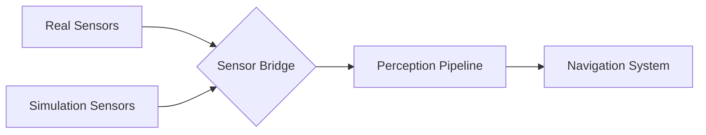

# Isaac Ecosystem Integration

## Overview

This document provides cross-references and integration points between the different components of the NVIDIA Isaac ecosystem: Isaac Sim, Isaac ROS, and Nav2. Understanding these connections is crucial for implementing complete humanoid robotics solutions.

## Integration Scenarios

### 1. Isaac Sim → Isaac ROS: Simulation to Perception Testing

The Isaac Sim environment provides simulated data for testing Isaac ROS perception pipelines:

- **Synthetic Data**: Isaac Sim generates labeled synthetic data for training perception models
- **Simulation Testing**: Isaac ROS perception pipelines can be tested in Isaac Sim before deployment
- **Domain Randomization**: Isaac Sim's domain randomization capabilities improve perception robustness

**Key Integration Points:**
- [Synthetic Data Generation](./isaac-sim/synthetic-data-generation.md) connects to [Hardware-Accelerated Perception](./isaac-ros/hardware-accelerated-perception.md)
- [USD Scene Composition](./isaac-sim/usd-scene-composition.md) enables realistic simulation for [VSLAM Pipelines](./isaac-ros/vslam-pipelines.md)

### 2. Isaac ROS → Nav2: Perception to Navigation

Perception data from Isaac ROS feeds into Nav2 navigation decisions:

- **Obstacle Detection**: Perception results provide obstacle information for path planning
- **Semantic Mapping**: Semantic segmentation results enhance navigation maps
- **Dynamic Obstacle Tracking**: Moving object detection enables dynamic navigation

**Key Integration Points:**
- [VSLAM Pipelines](./isaac-ros/vslam-pipelines.md) provide localization data for [Nav2 for Humanoid Navigation](./nav2-humanoid/index.md)
- [ROS 2 Integration](./isaac-ros/ros2-integration.md) connects perception and navigation nodes
- [Hardware Acceleration](./isaac-ros/hardware-accelerated-perception.md) ensures real-time performance for navigation

### 3. Isaac Sim → Nav2: Simulated Navigation Testing

Isaac Sim provides environments for testing Nav2 navigation algorithms:

- **Navigation Scenarios**: Simulated environments for testing navigation algorithms
- **Safety Testing**: Safe testing of navigation behaviors in simulation
- **Performance Validation**: Performance validation before real-world deployment

**Key Integration Points:**
- [Photorealistic Simulation](./isaac-sim/photorealistic-simulation.md) creates realistic navigation environments
- [Synthetic Data Generation](./isaac-sim/synthetic-data-generation.md) provides training data for navigation systems
- [RTX Rendering Configuration](./isaac-sim/photorealistic-simulation.md) enhances visual perception for navigation

## Workflow Integration

### Complete Development Workflow

1. **Simulation Setup** (Isaac Sim)
   - Create photorealistic simulation environment
   - Configure domain randomization for perception training
   - Generate synthetic datasets

2. **Perception Development** (Isaac ROS)
   - Develop hardware-accelerated perception pipelines
   - Test in Isaac Sim simulation environment
   - Optimize for real-time performance

3. **Navigation Implementation** (Nav2)
   - Configure navigation for humanoid-specific requirements
   - Integrate perception data for obstacle avoidance
   - Test in Isaac Sim environments before real-world deployment

## Common Patterns

### 1. Sensor Integration Pattern



### 2. Data Flow Pattern

```
Raw Sensor Data → Perception Processing → Navigation Input → Path Planning → Execution
```

## Best Practices

1. **Start with Simulation**: Always test in Isaac Sim before real-world deployment
2. **Iterative Development**: Develop perception and navigation in parallel with continuous integration
3. **Performance Validation**: Ensure perception and navigation systems meet real-time requirements
4. **Safety First**: Implement safety checks at each integration point
5. **Modular Design**: Keep perception and navigation systems modular for easy updates

## Troubleshooting Integration Issues

### Common Problems

1. **Timing Issues**: Perception and navigation running at different frequencies
   - Solution: Implement proper message synchronization and buffering

2. **Coordinate Frame Mismatches**: Different coordinate systems between components
   - Solution: Use TF2 for proper coordinate frame transformations

3. **Performance Bottlenecks**: Perception consuming too many resources for navigation
   - Solution: Optimize perception pipelines and implement resource management

## References

- [Isaac Sim Documentation](./isaac-sim/index.md) - Complete simulation setup and configuration
- [Isaac ROS Documentation](./isaac-ros/index.md) - Perception pipeline development
- [Nav2 Documentation](./nav2-humanoid/index.md) - Navigation system configuration
- [ROS 2 Integration Guide](./isaac-ros/ros2-integration.md) - Connecting all components