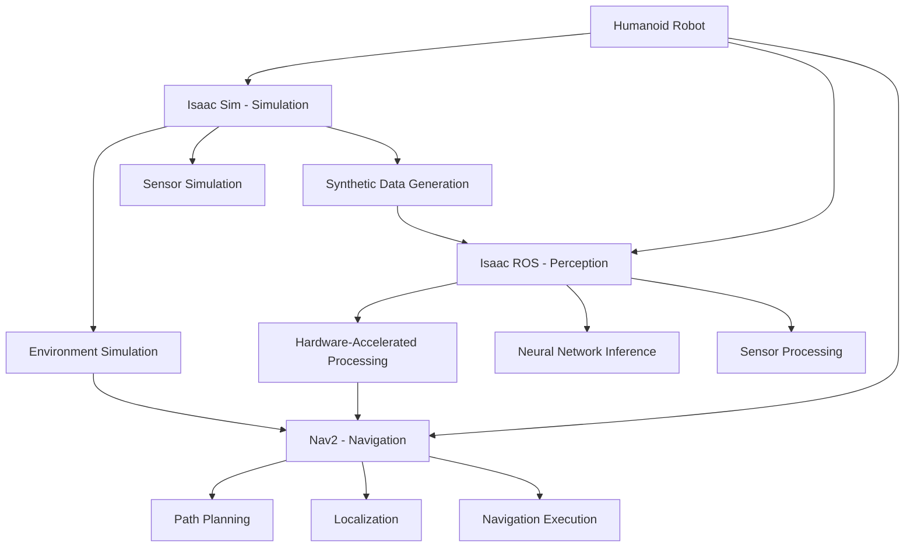

# Isaac Ecosystem Overview

## Introduction

The NVIDIA Isaac ecosystem provides a comprehensive solution for humanoid robotics development, integrating simulation, perception, and navigation capabilities. This ecosystem consists of three main components:

1. **Isaac Sim**: NVIDIA's robotics simulator for photorealistic simulation and synthetic data generation
2. **Isaac ROS**: Hardware-accelerated perception and manipulation packages for ROS 2
3. **Nav2**: ROS 2 navigation stack adapted for humanoid robotics

This document provides a comprehensive overview of how these components work together to enable advanced humanoid robotics applications.

## Isaac Ecosystem Architecture

### Component Overview



### The Isaac Ecosystem Workflow

The Isaac ecosystem follows a comprehensive workflow that moves from simulation to real-world deployment:

1. **Simulation Phase**: Develop and test in Isaac Sim with photorealistic environments
2. **Training Phase**: Generate synthetic data and train perception models
3. **Integration Phase**: Deploy Isaac ROS perception with Nav2 navigation
4. **Deployment Phase**: Execute on real humanoid robots with continuous learning

## Isaac Sim: The Simulation Foundation

### Core Capabilities

Isaac Sim serves as the foundation for the Isaac ecosystem, providing:

- **Photorealistic Simulation**: RTX rendering for realistic environments
- **Synthetic Data Generation**: Large-scale datasets for training perception models
- **Domain Randomization**: Techniques to improve sim-to-real transfer
- **USD Scene Composition**: Universal Scene Description for flexible scene creation
- **Physics Simulation**: Accurate physics for realistic robot interactions

### Key Features for Humanoid Robotics

#### 1. RTX Rendering and Photorealism

```python
# Example Isaac Sim configuration for humanoid robotics
from omni.isaac.kit import SimulationApp
from omni.isaac.synthetic_utils import SyntheticDataHelper

# Initialize Isaac Sim with RTX rendering
config = {
    "headless": False,
    "rendering_mode": "RTX",
    "width": 1920,
    "height": 1080
}

simulation_app = SimulationApp(config)

# Enable RTX rendering features
from omni.isaac.core.utils.extensions import enable_extension
enable_extension("omni.hydra.rtx")

# Configure synthetic data generation
synthetic_data = SyntheticDataHelper()
synthetic_data.enable_rgb_output(True)
synthetic_data.enable_depth_output(True)
synthetic_data.enable_segmentation_output(True)
```

#### 2. Synthetic Data Pipeline

The synthetic data pipeline enables training of perception models:

```yaml
# Synthetic data generation configuration
synthetic_data_pipeline:
  rendering:
    resolution: [1920, 1080]
    pixel_samples: 16
    max_surface_bounces: 8
    enable_denoiser: True

  domain_randomization:
    material_randomization: True
    lighting_randomization: True
    camera_position_randomization: False
    object_placement_randomization: True

  output_formats:
    rgb: True
    depth: True
    segmentation: True
    normals: False
    optical_flow: False

  validation:
    quality_threshold: 0.8
    synthetic_to_real_transfer: True
```

### Simulation-to-Reality Transfer

Isaac Sim bridges the gap between simulation and reality through:

- **Domain Randomization**: Techniques to make models robust to domain shift
- **Sim-to-Real Transfer**: Methods for deploying simulation-trained models to real robots
- **Validation Frameworks**: Tools to measure and improve transfer performance

## Isaac ROS: Hardware-Accelerated Perception

### Core Capabilities

Isaac ROS provides hardware-accelerated perception capabilities:

- **GPU Acceleration**: Leverage NVIDIA GPUs for real-time processing
- **TensorRT Integration**: Optimized neural network inference
- **Sensor Processing**: Accelerated processing of camera, LiDAR, and other sensors
- **ROS 2 Integration**: Seamless integration with the ROS 2 ecosystem

### Key Features for Humanoid Robotics

#### 1. Hardware Acceleration

```python
# Isaac ROS hardware acceleration example
import rclpy
from rclpy.node import Node
from sensor_msgs.msg import Image
from isaac_ros.image_proc import RectificationNode

class AcceleratedPerceptionNode(Node):
    def __init__(self):
        super().__init__('accelerated_perception_node')

        # Enable GPU acceleration
        self.declare_parameter('use_gpu', True)
        self.declare_parameter('gpu_id', 0)

        # Isaac ROS image processing with GPU acceleration
        self.image_sub = self.create_subscription(
            Image,
            '/camera/image_raw',
            self.image_callback,
            10
        )

        # Isaac ROS provides optimized processing pipelines
        self.rectification_node = RectificationNode(
            use_gpu=self.get_parameter('use_gpu').value,
            gpu_id=self.get_parameter('gpu_id').value
        )

    def image_callback(self, msg):
        """
        Process image with hardware acceleration
        """
        # Isaac ROS automatically uses GPU acceleration when available
        processed_image = self.rectification_node.rectify(msg)
        # Additional GPU-accelerated processing...
```

#### 2. Perception Pipeline Integration

```yaml
# Isaac ROS perception pipeline configuration
perception_pipeline:
  ros__parameters:
    # Camera processing
    camera:
      input_width: 1280
      input_height: 720
      enable_rectification: true
      enable_enhancement: true

    # Neural network inference
    neural_network:
      model_path: "/path/to/tensorrt/model.plan"
      input_tensor_name: "input"
      output_tensor_names: ["detection_boxes", "detection_classes", "detection_scores"]
      max_batch_size: 1
      confidence_threshold: 0.5

    # Hardware acceleration
    gpu:
      use_gpu: true
      gpu_id: 0
      use_tensorrt: true
      tensorrt_precision: "fp16"

    # Performance
    performance:
      processing_frequency: 30.0
      max_processing_time: 0.033
      enable_performance_monitoring: true
```

### Isaac ROS in the Humanoid Context

For humanoid robotics, Isaac ROS addresses specific challenges:

- **Head-Mounted Sensors**: Processing data from head-mounted cameras and sensors
- **Dynamic Balance**: Maintaining perception capabilities during locomotion
- **Multi-Sensor Fusion**: Integrating data from multiple sensors on the humanoid robot

## Nav2: Navigation for Humanoid Robots

### Core Capabilities

Nav2 provides navigation capabilities adapted for humanoid robots:

- **Path Planning**: Algorithms adapted for bipedal locomotion
- **Localization**: 3D localization for humanoid movement
- **Behavior Trees**: Flexible navigation behavior control
- **Humanoid Adaptations**: Specific modifications for bipedal robots

### Key Features for Humanoid Robotics

#### 1. Bipedal Path Planning

```python
# Humanoid-aware path planning example
from nav2_msgs.action import NavigateToPose
from geometry_msgs.msg import PoseStamped
import math

class HumanoidPathPlanner:
    def __init__(self):
        self.max_step_length = 0.4  # meters
        self.balance_margin = 0.1    # meters
        self.z_axis_navigation = True

    def plan_path_for_humanoid(self, start_pose, goal_pose):
        """
        Plan path considering humanoid constraints
        """
        # Standard path planning
        raw_path = self.plan_standard_path(start_pose, goal_pose)

        # Adapt for humanoid constraints
        humanoid_path = self.adapt_path_for_humanoid(raw_path)

        # Generate footstep sequence
        footsteps = self.generate_footsteps(humanoid_path)

        return footsteps

    def adapt_path_for_humanoid(self, raw_path):
        """
        Adapt path for humanoid-specific constraints
        """
        adapted_path = []

        for i in range(len(raw_path) - 1):
            current_pose = raw_path[i]
            next_pose = raw_path[i + 1]

            # Check humanoid-specific constraints
            if self.is_transition_feasible(current_pose, next_pose):
                adapted_path.append(next_pose)
            else:
                # Insert intermediate poses for balance
                intermediate_poses = self.generate_balance_preserving_path(
                    current_pose, next_pose
                )
                adapted_path.extend(intermediate_poses)

        return adapted_path

    def generate_footsteps(self, path):
        """
        Generate footstep sequence for humanoid execution
        """
        footsteps = []
        support_foot = "left"  # Start with left foot as support

        for i in range(len(path) - 1):
            current_pose = path[i]
            target_pose = path[i + 1]

            # Plan next step
            next_step = self.plan_next_step(current_pose, target_pose, support_foot)
            footsteps.append(next_step)

            # Alternate support foot
            support_foot = "right" if support_foot == "left" else "left"

        return footsteps
```

#### 2. 3D Navigation Configuration

```yaml
# Nav2 configuration for humanoid robots
bt_navigator:
  ros__parameters:
    use_sim_time: False
    global_frame: map
    robot_base_frame: base_link
    odom_topic: /odom
    bt_loop_duration: 10
    default_server_timeout: 20
    enable_groot_monitoring: True
    groot_zmq_publisher_port: 1666
    groot_zmq_server_port: 1667

controller_server:
  ros__parameters:
    use_sim_time: False
    controller_frequency: 20.0
    min_x_velocity_threshold: 0.001
    min_y_velocity_threshold: 0.001
    min_theta_velocity_threshold: 0.001
    progress_checker_plugin: "progress_checker"
    goal_checker_plugin: "goal_checker"
    controller_plugins: ["FollowPath"]

    FollowPath:
      plugin: "nav2_mppi_controller::MPPIController"
      time_steps: 50
      model_dt: 0.05
      batch_size: 1000
      vx_std: 0.2
      vy_std: 0.1
      wz_std: 0.4
      vx_max: 0.5
      vx_min: -0.1
      vy_max: 0.3
      wz_max: 0.5
      # Humanoid-specific constraints
      step_size_max: 0.4
      balance_margin: 0.15

local_costmap:
  local_costmap:
    ros__parameters:
      update_frequency: 5.0
      publish_frequency: 2.0
      global_frame: odom
      robot_base_frame: base_link
      use_sim_time: False
      rolling_window: true
      width: 6
      height: 6
      resolution: 0.05
      # Humanoid-specific parameters
      max_step_height: 0.2
      robot_height: 1.5
      min_headroom: 0.5

global_costmap:
  global_costmap:
    ros__parameters:
      update_frequency: 1.0
      publish_frequency: 1.0
      global_frame: map
      robot_base_frame: base_link
      use_sim_time: False
      robot_radius: 0.3
      # Humanoid-specific parameters
      max_step_height: 0.2
      robot_height: 1.5
      min_headroom: 0.5
```

## Integration Patterns

### 1. Simulation to Real Transfer

The most common integration pattern involves using Isaac Sim to generate training data for Isaac ROS perception, which is then used for navigation with Nav2:

```python
# Complete integration example
class IsaacEcosystemIntegration:
    def __init__(self):
        # Isaac Sim for data generation
        self.simulator = IsaacSimInterface()

        # Isaac ROS for perception
        self.perception = IsaacROSInterface()

        # Nav2 for navigation
        self.navigation = Nav2Interface()

        # Integration bridge
        self.bridge = EcosystemBridge()

    def simulation_training_pipeline(self):
        """
        Complete pipeline: Sim -> Training -> Real Deployment
        """
        # Step 1: Generate synthetic data in Isaac Sim
        synthetic_dataset = self.simulator.generate_synthetic_data(
            domain_randomization=True
        )

        # Step 2: Train perception model
        trained_model = self.perception.train_model(
            synthetic_dataset,
            validation_split=0.2
        )

        # Step 3: Optimize for Isaac ROS deployment
        optimized_model = self.perception.optimize_for_ros(
            trained_model,
            hardware_target="jetson_agx_xavier"
        )

        # Step 4: Deploy perception with navigation
        self.perception.deploy_model(optimized_model)
        self.navigation.enable_perception_integration(
            perception_topic="/isaac_ros/detections"
        )

        # Step 5: Execute navigation with perception feedback
        navigation_result = self.navigation.execute_navigation_with_perception()

        return navigation_result
```

### 2. Perception-Enhanced Navigation

Isaac ROS perception can enhance Nav2 navigation capabilities:

```yaml
# Perception-enhanced navigation configuration
perception_enhanced_navigation:
  perception_integration:
    obstacle_detection: true
    dynamic_object_tracking: true
    environment_classification: true

  navigation_enhancement:
    perception_costmap_layer: true
    dynamic_obstacle_avoidance: true
    semantic_navigation: true

  safety_features:
    perception_safety_fallback: true
    sensor_fusion_validation: true
    redundant_perception: true
```

## Humanoid Robotics Applications

### 1. Human-Robot Interaction

The Isaac ecosystem enables sophisticated human-robot interaction for humanoid robots:

- **Person Detection**: Isaac ROS detects and tracks humans in the environment
- **Social Navigation**: Nav2 navigates considering social norms and human comfort
- **Gesture Recognition**: Perception systems recognize human gestures and intentions

### 2. Complex Environment Navigation

Humanoid robots can navigate complex environments using the Isaac ecosystem:

- **Stair Navigation**: Z-axis navigation capabilities in Nav2
- **Ramp Navigation**: Inclined surface navigation
- **Dynamic Obstacle Avoidance**: Real-time obstacle detection and avoidance

### 3. Manipulation and Perception

The ecosystem supports complex manipulation tasks:

- **Object Recognition**: Isaac ROS identifies and localizes objects
- **Grasp Planning**: Simulation-based grasp planning and validation
- **Task Execution**: Coordinated perception and navigation for task completion

## Development Workflow

### 1. Simulation-First Approach

The recommended development workflow for humanoid robotics with the Isaac ecosystem:

1. **Environment Setup**: Create simulation environments in Isaac Sim
2. **Perception Training**: Generate synthetic data and train perception models
3. **Navigation Planning**: Plan and test navigation in simulation
4. **Integration Testing**: Test complete perception-navigation pipeline in simulation
5. **Real Robot Deployment**: Deploy to real humanoid robot with appropriate safety measures

### 2. Iterative Improvement

The ecosystem supports iterative improvement through:

- **Simulation Testing**: Rapid iteration in safe simulation environment
- **Synthetic Data Generation**: Continuous generation of training data
- **Performance Monitoring**: Real-world performance feedback
- **Model Retraining**: Continuous improvement based on real-world experience

## Best Practices

### 1. System Design

- **Modular Architecture**: Design components to work independently and together
- **Performance Monitoring**: Monitor performance across all ecosystem components
- **Safety Considerations**: Implement safety measures for real robot deployment
- **Scalability**: Design systems to scale with increasing complexity

### 2. Development Process

- **Simulation Validation**: Extensively test in simulation before real robot deployment
- **Incremental Complexity**: Start with simple tasks and increase complexity gradually
- **Cross-Module Testing**: Test integration between Isaac Sim, ROS, and Nav2
- **Documentation**: Maintain comprehensive documentation for all components

## Conclusion

The Isaac ecosystem provides a comprehensive solution for humanoid robotics development, combining simulation, perception, and navigation capabilities in a unified framework. By leveraging Isaac Sim for training and testing, Isaac ROS for hardware-accelerated perception, and Nav2 for humanoid-aware navigation, developers can create sophisticated humanoid robotics applications that bridge the gap between simulation and reality.

The integration of these components enables advanced capabilities such as perception-enhanced navigation, human-robot interaction, and complex environment navigation, making it possible to deploy humanoid robots in real-world scenarios with confidence in their capabilities and safety.