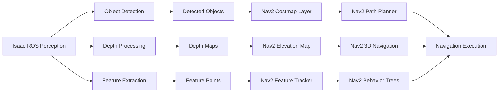

# Isaac ROS to Nav2 Integration

## Introduction

The integration between Isaac ROS and Nav2 enables perception-enhanced navigation for humanoid robots. This document provides detailed examples of how Isaac ROS perception data feeds into Nav2 navigation decisions, creating intelligent navigation systems that can adapt to dynamic environments and detected objects.

## Integration Architecture

### Data Flow from Isaac ROS to Nav2

The integration follows a comprehensive data flow that moves from perception to navigation:



### Key Integration Points

1. **Object Detection Integration**: Isaac ROS object detections feed into Nav2 costmaps
2. **Depth Processing**: Isaac ROS depth processing enhances Nav2 navigation
3. **Feature Tracking**: Isaac ROS features support Nav2 localization and navigation
4. **Dynamic Obstacle Avoidance**: Real-time perception enables dynamic navigation

## Object Detection to Navigation Integration

### Costmap Integration

```python
# Isaac ROS to Nav2 costmap integration
import rclpy
from rclpy.node import Node
from sensor_msgs.msg import Image, PointCloud2
from visualization_msgs.msg import MarkerArray
from geometry_msgs.msg import Point
from nav2_msgs.msg import Costmap
from std_msgs.msg import Header
from builtin_interfaces.msg import Time
import numpy as np

class IsaacROSNav2CostmapBridge(Node):
    def __init__(self):
        super().__init__('isaac_ros_nav2_costmap_bridge')

        # Isaac ROS perception subscribers
        self.detection_sub = self.create_subscription(
            Detection2DArray,
            '/isaac_ros/detections',
            self.detection_callback,
            10
        )

        self.depth_sub = self.create_subscription(
            Image,
            '/isaac_ros/depth',
            self.depth_callback,
            10
        )

        # Nav2 costmap publishers
        self.dynamic_costmap_pub = self.create_publisher(
            OccupancyGrid,
            '/global_costmap/costmap',
            10
        )

        # Object tracking
        self.object_tracker = ObjectTracker()

        # Costmap integration parameters
        self.declare_parameter('max_object_height', 2.0)
        self.declare_parameter('object_cost', 254)  # lethal cost
        self.declare_parameter('clearing_distance', 0.5)  # meters

    def detection_callback(self, detections):
        """
        Process Isaac ROS detections for Nav2 costmap integration
        """
        dynamic_obstacles = []

        for detection in detections.detections:
            # Convert Isaac ROS detection to navigation obstacle
            obstacle = self.convert_detection_to_obstacle(detection)
            if obstacle:
                dynamic_obstacles.append(obstacle)

        # Update Nav2 costmap with dynamic obstacles
        self.update_costmap_with_obstacles(dynamic_obstacles)

    def convert_detection_to_obstacle(self, detection):
        """
        Convert Isaac ROS detection format to navigation obstacle
        """
        # Get object pose from detection
        if detection.bbox.center.x and detection.bbox.center.y:
            # Convert image coordinates to world coordinates
            world_pose = self.image_to_world_coordinates(
                detection.bbox.center.x,
                detection.bbox.center.y,
                detection.results[0].id if detection.results else 0
            )

            # Create obstacle representation
            obstacle = {
                'position': world_pose,
                'size': self.estimate_object_size(detection),
                'confidence': detection.results[0].score if detection.results else 0.0,
                'class_id': detection.results[0].id if detection.results else 0,
                'class_name': self.get_class_name(detection.results[0].id if detection.results else 0)
            }

            # Only include obstacles that affect navigation
            if self.is_navigable_obstacle(obstacle):
                return obstacle

        return None

    def update_costmap_with_obstacles(self, obstacles):
        """
        Update Nav2 costmap with detected obstacles
        """
        # Get current costmap
        current_costmap = self.get_current_costmap()

        # Update costmap with dynamic obstacles
        for obstacle in obstacles:
            if obstacle['confidence'] > 0.7:  # High confidence detections only
                # Calculate affected area in costmap
                affected_cells = self.calculate_affected_area(
                    obstacle['position'],
                    obstacle['size']
                )

                # Update costmap cells with obstacle information
                for cell in affected_cells:
                    if 0 <= cell[0] < current_costmap.info.width and \
                       0 <= cell[1] < current_costmap.info.height:
                        # Set high cost for obstacle location
                        cell_index = cell[1] * current_costmap.info.width + cell[0]
                        current_costmap.data[cell_index] = min(
                            254,  # Max cost
                            current_costmap.data[cell_index] + 100
                        )

        # Publish updated costmap
        self.dynamic_costmap_pub.publish(current_costmap)

    def image_to_world_coordinates(self, u, v, depth):
        """
        Convert image coordinates to world coordinates
        """
        # Use camera intrinsics to convert to world coordinates
        # Implementation depends on camera calibration
        return [0.0, 0.0, 0.0]  # Placeholder

    def estimate_object_size(self, detection):
        """
        Estimate object size from detection bounding box
        """
        width = detection.bbox.size_x
        height = detection.bbox.size_y
        return [width, height]

    def is_navigable_obstacle(self, obstacle):
        """
        Check if obstacle affects navigation
        """
        # Only consider obstacles within navigable height range
        max_height = self.get_parameter('max_object_height').value
        return obstacle['position'][2] <= max_height
```

### Dynamic Obstacle Avoidance

```python
# Dynamic obstacle avoidance using Isaac ROS perception
class DynamicObstacleAvoider:
    def __init__(self):
        # Isaac ROS object detection
        self.detection_sub = self.create_subscription(
            Detection2DArray,
            '/isaac_ros/detections',
            self.detection_callback,
            10
        )

        # Nav2 navigation interface
        self.navigator = BasicNavigator()

        # Dynamic obstacle tracking
        self.obstacle_tracker = ObjectTracker()
        self.dynamic_path_planner = DynamicPathPlanner()

    def detection_callback(self, detections):
        """
        Process Isaac ROS detections for dynamic navigation
        """
        # Update obstacle tracker with new detections
        tracked_obstacles = self.obstacle_tracker.update(detections)

        # Filter for moving obstacles that affect navigation
        moving_obstacles = [
            obs for obs in tracked_obstacles
            if self.is_moving_obstacle(obs) and self.is_navigation_relevant(obs)
        ]

        # Update navigation with dynamic obstacle information
        self.update_navigation_with_obstacles(moving_obstacles)

    def update_navigation_with_obstacles(self, obstacles):
        """
        Update navigation system with dynamic obstacle information
        """
        # If obstacles detected, replan path avoiding them
        if obstacles:
            current_pose = self.navigator.getRobotPose()
            goal_pose = self.navigator.getGoalPose()

            # Plan path avoiding dynamic obstacles
            safe_path = self.dynamic_path_planner.plan_path_with_obstacles(
                current_pose,
                goal_pose,
                obstacles
            )

            # Update navigation with safe path
            self.navigator.updateGlobalPath(safe_path)

    def is_moving_obstacle(self, obstacle):
        """
        Check if obstacle is moving and affects navigation
        """
        # Check if obstacle velocity exceeds threshold
        velocity_threshold = 0.1  # m/s
        return np.linalg.norm(obstacle.velocity) > velocity_threshold

    def is_navigation_relevant(self, obstacle):
        """
        Check if obstacle is relevant for navigation
        """
        # Check if obstacle is in navigation path
        # Implementation depends on path prediction
        return True  # Placeholder
```

## Depth Processing Integration

### Depth to Elevation Map

```python
# Isaac ROS depth processing for Nav2 elevation mapping
class DepthToElevationMapper:
    def __init__(self):
        # Isaac ROS depth subscription
        self.depth_sub = self.create_subscription(
            Image,
            '/isaac_ros/depth',
            self.depth_callback,
            10
        )

        # Nav2 elevation map publisher
        self.elevation_map_pub = self.create_publisher(
            OccupancyGrid,
            '/elevation_map',
            10
        )

        # Depth processing parameters
        self.depth_scale_factor = 0.001  # Convert mm to meters
        self.grid_resolution = 0.1  # 10cm resolution
        self.elevation_map = None

    def depth_callback(self, depth_msg):
        """
        Process Isaac ROS depth data for elevation mapping
        """
        # Convert depth image to numpy array
        depth_array = self.convert_depth_msg_to_array(depth_msg)

        # Process depth data for elevation mapping
        elevation_data = self.process_depth_for_elevation(depth_array)

        # Update elevation map
        self.update_elevation_map(elevation_data)

        # Publish elevation map for Nav2
        self.publish_elevation_map()

    def process_depth_for_elevation(self, depth_array):
        """
        Process depth array for elevation mapping
        """
        # Apply depth scaling
        scaled_depth = depth_array * self.depth_scale_factor

        # Filter invalid depth values
        valid_depth = np.where(scaled_depth > 0, scaled_depth, np.nan)

        # Convert to elevation grid
        elevation_grid = self.depth_to_elevation_grid(valid_depth)

        return elevation_grid

    def depth_to_elevation_grid(self, depth_data):
        """
        Convert depth data to elevation grid
        """
        # Convert depth measurements to elevation map
        # Implementation depends on robot position and orientation
        return depth_data  # Placeholder
```

## Behavior Tree Integration

### Perception-Enhanced Behavior Trees

```xml
<!-- Perception-enhanced behavior tree for Nav2 -->
<root main_tree_to_execute="MainTree">
    <BehaviorTree ID="MainTree">
        <ReactiveSequence name="MainNavigationSequence">
            <GoalUpdated/>
            <Fallback name="NavigationFallback">
                <Sequence name="SafeNavigation">
                    <!-- Check for dynamic obstacles using Isaac ROS perception -->
                    <IsaacROSDynamicObstacleCheck obstacles="{dynamic_obstacles}"/>

                    <!-- Compute path considering dynamic obstacles -->
                    <ComputePathToPose goal="{goal}" path="{path}">
                        <with_behavior>
                            <IsaacROSObstacleAwarePlanner obstacles="{dynamic_obstacles}"/>
                        </with_behavior>
                    </ComputePathToPose>

                    <!-- Execute path with perception feedback -->
                    <Fallback name="PathExecutionFallback">
                        <RecoveryNode number_of_retries="3">
                            <Sequence name="FollowPathWithPerception">
                                <SmoothPath path="{path}" output="{smoothed_path}"/>
                                <FollowPath path="{smoothed_path}">
                                    <with_perception_monitoring>
                                        <IsaacROSPerceptionMonitor/>
                                    </with_perception_monitoring>
                                </FollowPath>
                            </Sequence>
                            <ClearEntireCostmap name="ClearLocalCostmap" service_name="local_costmap/clear_entirely_local_costmap"/>
                        </RecoveryNode>

                        <!-- Alternative navigation if primary fails -->
                        <ReactiveSequence name="AlternativeNavigation">
                            <CheckGoalReaching goal="{goal}" tolerance="0.5"/>
                            <NavigateWithRecovery goal="{goal}">
                                <with_perception_recovery>
                                    <IsaacROSPerceptionRecovery/>
                                </with_perception_recovery>
                            </NavigateWithRecovery>
                        </ReactiveSequence>
                    </Fallback>
                </Sequence>

                <!-- Emergency navigation if planning fails -->
                <NavigateToPose goal="{goal}"/>
            </Fallback>
        </ReactiveSequence>
    </BehaviorTree>

    <!-- Custom perception-enhanced nodes -->
    <TreeNodeModel>
        <Action ID="IsaacROSDynamicObstacleCheck">
            <input_port name="detection_topic" type="std::string" default="/isaac_ros/detections"/>
            <output_port name="dynamic_obstacles" type="vector&lt;Obstacle&gt;"/>
        </Action>
        <Action ID="IsaacROSObstacleAwarePlanner">
            <input_port name="obstacles" type="vector&lt;Obstacle&gt;"/>
        </Action>
        <Condition ID="IsaacROSPerceptionMonitor">
            <input_port name="monitoring_enabled" type="bool" default="true"/>
        </Condition>
        <Action ID="IsaacROSPerceptionRecovery">
            <input_port name="recovery_type" type="std::string" default="perception_guided"/>
        </Action>
    </TreeNodeModel>
</root>
```

### Custom Behavior Tree Nodes

```cpp
// Custom behavior tree node for Isaac ROS perception integration
#include "behaviortree_cpp_v3/action_node.h"
#include "isaac_ros_interfaces/msg/detection2_d_array.hpp"
#include "geometry_msgs/msg/pose_stamped.hpp"

class IsaacROSDynamicObstacleCheck : public BT::ActionNodeBase
{
public:
    IsaacROSDynamicObstacleCheck(const std::string& name, const BT::NodeConfiguration& config)
        : BT::ActionNodeBase(name, config)
    {
        node_ = rclcpp::Node::make_shared("isaac_ros_dynamic_obstacle_check");
        detection_sub_ = node_->create_subscription<isaac_ros_interfaces::msg::Detection2DArray>(
            "/isaac_ros/detections", 10,
            std::bind(&IsaacROSDynamicObstacleCheck::detectionCallback, this, std::placeholders::_1)
        );
    }

    static BT::PortsList providedPorts()
    {
        return {
            BT::OutputPort<std::vector<Obstacle>>("dynamic_obstacles", "Detected dynamic obstacles"),
            BT::InputPort<std::string>("detection_topic", "Topic for Isaac ROS detections")
        };
    }

private:
    BT::NodeStatus tick() override
    {
        // Wait for latest detections
        if (!latest_detections_) {
            return BT::NodeStatus::RUNNING;
        }

        // Process detections for dynamic obstacles
        std::vector<Obstacle> dynamic_obstacles = extractDynamicObstacles(*latest_detections_);

        // Output dynamic obstacles
        if (auto obstacles_port = config().blackboard->get<std::vector<Obstacle>*>("dynamic_obstacles")) {
            *obstacles_port = dynamic_obstacles;
        }

        // Determine status based on obstacle detection
        if (!dynamic_obstacles.empty()) {
            return BT::NodeStatus::SUCCESS;  // Obstacles detected, need to avoid
        } else {
            return BT::NodeStatus::FAILURE;  // No obstacles, can proceed normally
        }
    }

    void halt() override
    {
        // Reset state
    }

    void detectionCallback(const isaac_ros_interfaces::msg::Detection2DArray::SharedPtr msg)
    {
        latest_detections_ = msg;
    }

    std::vector<Obstacle> extractDynamicObstacles(const isaac_ros_interfaces::msg::Detection2DArray& detections)
    {
        std::vector<Obstacle> dynamic_obstacles;

        // Extract obstacles that are likely to move or affect navigation
        for (const auto& detection : detections.detections) {
            if (isDynamicObject(detection)) {
                Obstacle obstacle = convertDetectionToObstacle(detection);
                dynamic_obstacles.push_back(obstacle);
            }
        }

        return dynamic_obstacles;
    }

    bool isDynamicObject(const Detection2D& detection)
    {
        // Check if detection is for a dynamic object (person, vehicle, etc.)
        // Implementation depends on object classes
        return detection.results[0].id == 0;  // Example: person class
    }

    Obstacle convertDetectionToObstacle(const Detection2D& detection)
    {
        Obstacle obstacle;
        // Convert detection to obstacle format
        return obstacle;
    }

    rclcpp::Node::SharedPtr node_;
    rclcpp::Subscription<isaac_ros_interfaces::msg::Detection2DArray>::SharedPtr detection_sub_;
    isaac_ros_interfaces::msg::Detection2DArray::SharedPtr latest_detections_;
};
```

## Humanoid-Specific Integration

### Bipedal Navigation with Perception

```python
# Humanoid-specific navigation with Isaac ROS perception
class HumanoidPerceptionNavigation:
    def __init__(self):
        # Isaac ROS perception
        self.perception_sub = self.create_subscription(
            Detection2DArray,
            '/isaac_ros/detections',
            self.perception_callback,
            10
        )

        # Nav2 navigation for humanoid
        self.navigator = HumanoidNavigator()

        # Humanoid-specific parameters
        self.step_size = 0.4  # meters
        self.balance_margin = 0.1  # meters
        self.z_axis_navigation = True

    def perception_callback(self, detections):
        """
        Process Isaac ROS detections for humanoid navigation
        """
        # Process detections for humanoid-specific navigation
        humanoid_obstacles = self.filter_humanoid_obstacles(detections)

        # Update navigation with humanoid-specific obstacle information
        self.update_humanoid_navigation(humanoid_obstacles)

    def filter_humanoid_obstacles(self, detections):
        """
        Filter obstacles relevant for humanoid navigation
        """
        humanoid_obstacles = []

        for detection in detections.detections:
            # Consider obstacles at humanoid height
            if self.is_humanoid_relevant_obstacle(detection):
                humanoid_obstacles.append(detection)

        return humanoid_obstacles

    def is_humanoid_relevant_obstacle(self, detection):
        """
        Check if obstacle is relevant for humanoid navigation
        """
        # Check if obstacle height is within humanoid navigation range
        # Consider obstacles that could affect bipedal locomotion
        return True  # Placeholder

    def update_humanoid_navigation(self, obstacles):
        """
        Update humanoid navigation with perception data
        """
        # Plan footstep path considering obstacles
        footstep_path = self.plan_footstep_path_with_obstacles(obstacles)

        # Execute footstep navigation
        self.navigator.execute_footstep_navigation(footstep_path)
```

## Complete Integration Example

### Person-Aware Navigation

```python
# Complete integration example: Person-aware navigation
class PersonAwareNavigation:
    def __init__(self):
        # Isaac ROS person detection
        self.person_detector = IsaacROSPersonDetector()

        # Nav2 navigation
        self.navigator = BasicNavigator()

        # Social navigation behaviors
        self.social_navigator = SocialNavigationModule()

    def navigate_with_person_awareness(self, goal_pose):
        """
        Navigate to goal while being aware of detected persons
        """
        # Start person detection
        self.person_detector.start_detection()

        # Plan initial path
        initial_path = self.navigator.getPath(goal_pose)

        # Monitor for persons during navigation
        person_monitor = PersonMonitor(
            detection_callback=self.person_detection_callback
        )

        # Navigate with person awareness
        success = self.execute_person_aware_navigation(
            goal_pose,
            person_monitor
        )

        return success

    def person_detection_callback(self, detections):
        """
        Handle person detections for navigation
        """
        persons = [det for det in detections.detections
                  if det.results and det.results[0].id == 0]  # Person class

        if persons:
            # Update navigation behavior based on person locations
            self.update_navigation_for_social_interaction(persons)

    def update_navigation_for_social_interaction(self, persons):
        """
        Update navigation for social interaction with detected persons
        """
        for person in persons:
            person_position = self.detection_to_world_coordinates(person)

            # Check if person is in navigation path
            if self.is_person_on_path(person_position):
                # Adjust navigation for social behavior
                self.social_navigator.adjust_navigation_for_person(
                    person_position,
                    preferred_distance=1.0  # meter
                )

    def execute_person_aware_navigation(self, goal_pose, person_monitor):
        """
        Execute navigation with continuous person awareness
        """
        try:
            # Start person monitoring
            person_monitor.start_monitoring()

            # Execute navigation
            result = self.navigator.goToPose(goal_pose)

            # Wait for completion
            while not result.done():
                # Check for new person detections
                person_detections = person_monitor.get_latest_detections()

                if person_detections:
                    self.person_detection_callback(person_detections)

            return result.success

        finally:
            person_monitor.stop_monitoring()
```

### Multi-Sensor Fusion for Navigation

```python
# Multi-sensor fusion for enhanced navigation
class MultiSensorFusionNavigation:
    def __init__(self):
        # Isaac ROS sensors
        self.object_detector = self.create_subscription(
            Detection2DArray, '/isaac_ros/detections', self.detection_callback, 10
        )
        self.depth_processor = self.create_subscription(
            Image, '/isaac_ros/depth', self.depth_callback, 10
        )
        self.vslam_processor = self.create_subscription(
            PoseStamped, '/isaac_ros/vslam/pose', self.vslam_callback, 10
        )

        # Fusion module
        self.sensor_fusion = SensorFusionModule()

        # Nav2 navigation
        self.navigator = BasicNavigator()

    def detection_callback(self, detections):
        """
        Handle object detections for navigation
        """
        self.sensor_fusion.add_detection_data(detections)

    def depth_callback(self, depth_msg):
        """
        Handle depth data for navigation
        """
        self.sensor_fusion.add_depth_data(depth_msg)

    def vslam_callback(self, pose_msg):
        """
        Handle VSLAM pose for navigation
        """
        self.sensor_fusion.add_pose_data(pose_msg)

    def get_fused_navigation_data(self):
        """
        Get fused sensor data for navigation
        """
        return self.sensor_fusion.get_fused_data()

    def navigate_with_sensor_fusion(self, goal_pose):
        """
        Navigate using fused sensor data
        """
        # Get fused sensor data
        fused_data = self.get_fused_navigation_data()

        # Plan path considering all sensor inputs
        path = self.plan_fused_sensor_path(goal_pose, fused_data)

        # Execute navigation with sensor fusion
        result = self.navigator.followPath(path)

        return result

    def plan_fused_sensor_path(self, goal_pose, fused_data):
        """
        Plan path using fused sensor data
        """
        # Consider multiple sensor inputs:
        # - Object detections for obstacle avoidance
        # - Depth data for terrain analysis
        # - VSLAM pose for localization
        # - Other sensors as needed

        return self.navigator.getPath(goal_pose)
```

## Configuration Examples

### Isaac ROS to Nav2 Integration Configuration

```yaml
# Isaac ROS to Nav2 integration configuration
isaac_ros_nav2_integration:
  ros__parameters:
    # Perception integration
    perception:
      detection_topic: "/isaac_ros/detections"
      depth_topic: "/isaac_ros/depth"
      vslam_topic: "/isaac_ros/vslam/pose"
      detection_confidence_threshold: 0.7
      max_detection_distance: 10.0  # meters

    # Costmap integration
    costmap:
      enable_dynamic_obstacles: true
      dynamic_obstacle_topic: "/dynamic_obstacles"
      max_obstacle_height: 2.0  # meters
      obstacle_cost: 254  # lethal
      clearing_distance: 0.5  # meters

    # Navigation parameters
    navigation:
      enable_perception_guided: true
      perception_timeout: 5.0  # seconds
      min_perception_frequency: 10.0  # Hz
      safety_distance: 0.8  # meters from detected obstacles

    # Humanoid-specific parameters
    humanoid:
      enable_footstep_planning: true
      step_size_max: 0.4
      balance_margin: 0.15
      z_axis_navigation: true

# Nav2 costmap configuration with Isaac ROS integration
local_costmap:
  local_costmap:
    ros__parameters:
      update_frequency: 5.0
      publish_frequency: 2.0
      global_frame: odom
      robot_base_frame: base_link
      use_sim_time: false
      rolling_window: true
      width: 6
      height: 6
      resolution: 0.05
      # Isaac ROS perception integration
      plugins: [
        "static_layer",
        "obstacle_layer",
        "isaac_ros_perception_layer",  # Isaac ROS integration
        "inflation_layer"
      ]
      isaac_ros_perception_layer:
        plugin: "isaac_ros_nav2_integration.IsaacROSPeceptionLayer"
        enabled: true
        observation_sources: ["isaac_ros_detections"]
        isaac_ros_detections:
          topic: "/isaac_ros/detections"
          max_obstacle_height: 2.0
          clearing: true
          marking: true
          data_type: "PointCloud2"
          expected_update_rate: 10.0
          observation_persistence: 0.1
          marking_threshold: 1
```

## Best Practices

### Integration Best Practices

1. **Data Synchronization**: Ensure proper synchronization between Isaac ROS and Nav2 data streams
2. **Performance Optimization**: Optimize perception processing for real-time navigation
3. **Safety Considerations**: Implement safety measures for perception-based navigation
4. **Fallback Mechanisms**: Provide fallback navigation when perception fails

### Testing Best Practices

1. **Simulation Testing**: Test integration in simulation before real robot deployment
2. **Progressive Complexity**: Start with simple scenarios and increase complexity
3. **Validation Framework**: Implement comprehensive validation of perception-navigation integration
4. **Edge Case Handling**: Test edge cases and failure scenarios

## Troubleshooting

### Common Integration Issues

```yaml
# Troubleshooting guide for Isaac ROS to Nav2 integration
troubleshooting:
  common_issues:
    - issue: "Perception data not affecting navigation"
      symptoms:
        - "Detected objects don't appear in costmap"
        - "Navigation ignores dynamic obstacles"
      causes:
        - "Topic remapping issues"
        - "Coordinate frame mismatches"
        - "Costmap configuration problems"
      solutions:
        - "Verify topic connections with 'ros2 topic list'"
        - "Check TF tree for frame relationships"
        - "Validate costmap configuration"

    - issue: "High computational load during integration"
      symptoms:
        - "Navigation performance degradation"
        - "High CPU/GPU usage"
      causes:
        - "Frequent perception updates"
        - "Complex processing algorithms"
        - "Inefficient data structures"
      solutions:
        - "Throttle perception update rate"
        - "Optimize processing algorithms"
        - "Use efficient data structures"

    - issue: "Perception-navigation timing issues"
      symptoms:
        - "Navigation decisions based on outdated perception"
        - "Synchronization problems"
      causes:
        - "Message timestamp issues"
        - "Processing delays"
        - "Buffer overflows"
      solutions:
        - "Implement proper timestamp handling"
        - "Optimize processing pipeline"
        - "Use appropriate buffer sizes"
```

## Conclusion

The integration between Isaac ROS and Nav2 creates powerful perception-enhanced navigation capabilities for humanoid robots. By leveraging Isaac ROS perception data, Nav2 can make more intelligent navigation decisions, avoid dynamic obstacles, and adapt to changing environments. This integration enables robots to operate more safely and effectively in complex, human-populated environments.