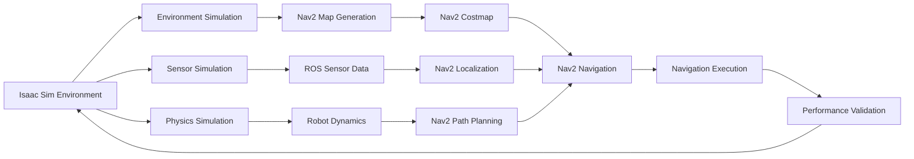

# Isaac Sim to Nav2 Integration

## Introduction

The integration between Isaac Sim and Nav2 enables comprehensive testing and validation of navigation algorithms in realistic simulation environments. This document provides detailed examples of how Isaac Sim environments can be used for Nav2 navigation testing, including simulated navigation scenarios, environment validation, and simulation-to-reality transfer techniques.

## Integration Architecture

### Data Flow from Isaac Sim to Nav2

The integration follows a comprehensive data flow that moves from simulation to navigation execution:



### Key Integration Points

1. **Environment Simulation**: Isaac Sim generates realistic environments for Nav2 testing
2. **Sensor Simulation**: Isaac Sim provides realistic sensor data for Nav2 localization
3. **Physics Simulation**: Isaac Sim simulates robot dynamics for realistic navigation
4. **Validation Framework**: Framework for validating navigation performance in simulation

## Environment Simulation for Navigation

### Creating Navigation Test Environments

```python
# Creating navigation test environments in Isaac Sim
from omni.isaac.kit import SimulationApp
from omni.isaac.core import World
from omni.isaac.core.utils.stage import add_reference_to_stage
from omni.isaac.core.utils.prims import create_prim
from pxr import Gf, UsdGeom
import numpy as np

class IsaacSimNav2Environment:
    def __init__(self):
        # Initialize Isaac Sim
        self.simulation_app = SimulationApp({"headless": False})
        self.world = World(stage_units_in_meters=1.0)

        # Setup stage
        self.stage = omni.usd.get_context().get_stage()

        # Navigation-specific parameters
        self.nav_test_params = {
            "min_obstacle_clearance": 0.5,  # meters
            "max_slope_angle": 15.0,        # degrees
            "step_height_max": 0.2,         # meters
            "navigation_area_margin": 1.0   # meters
        }

    def create_navigation_test_environment(self):
        """
        Create comprehensive navigation test environment
        """
        # Create ground plane
        self.create_ground_plane()

        # Create static obstacles
        self.create_static_obstacles()

        # Create dynamic obstacles
        self.create_dynamic_obstacles()

        # Create navigation test areas
        self.create_navigation_test_zones()

        # Create complex navigation scenarios
        self.create_complex_scenarios()

    def create_ground_plane(self):
        """
        Create ground plane for navigation
        """
        # Create large ground plane
        ground_prim = UsdGeom.Cone.Define(self.stage, "/World/GroundPlane")
        ground_mesh = UsdGeom.Mesh.Define(self.stage, "/World/GroundPlane/Mesh")

        # Set ground properties
        ground_mesh.CreatePointsAttr().Set([
            (-10, -10, 0), (10, -10, 0), (10, 10, 0), (-10, 10, 0)
        ])
        ground_mesh.CreateFaceVertexCountsAttr([4])
        ground_mesh.CreateFaceVertexIndicesAttr([0, 1, 2, 3])

    def create_static_obstacles(self):
        """
        Create static obstacles for navigation testing
        """
        # Create various obstacle types
        obstacle_configs = [
            {"type": "box", "position": (2, 0, 0), "size": (1, 1, 2)},
            {"type": "cylinder", "position": (-2, 3, 0), "radius": 0.5, "height": 2},
            {"type": "wall", "position": (0, -5, 0), "size": (10, 0.2, 2)},
        ]

        for i, config in enumerate(obstacle_configs):
            self.create_obstacle(f"/World/StaticObstacles/Obstacle_{i}", config)

    def create_dynamic_obstacles(self):
        """
        Create dynamic obstacles for navigation testing
        """
        # Create moving obstacles
        moving_obstacles = [
            {"type": "person", "position": (3, 2, 0), "movement_pattern": "circular"},
            {"type": "box", "position": (-3, -2, 0), "movement_pattern": "linear"},
        ]

        for i, config in enumerate(moving_obstacles):
            self.create_moving_obstacle(f"/World/DynamicObstacles/MovingObstacle_{i}", config)

    def create_navigation_test_zones(self):
        """
        Create specific zones for navigation testing
        """
        # Create narrow passages
        self.create_narrow_passage((0, 5, 0), width=0.8, length=2.0)

        # Create open areas
        self.create_open_area((5, 5, 0), radius=3.0)

        # Create cluttered areas
        self.create_cluttered_area((-5, -5, 0), size=(4, 4))

    def create_complex_scenarios(self):
        """
        Create complex navigation scenarios
        """
        # Create multi-level navigation (stairs/ramps)
        self.create_stairs_scenario()

        # Create crowded navigation
        self.create_crowded_scenario()

        # Create dynamic obstacle avoidance
        self.create_dynamic_avoidance_scenario()

    def create_stairs_scenario(self):
        """
        Create stairs scenario for Z-axis navigation testing
        """
        # Create step-by-step stairs
        for i in range(5):
            step_height = 0.15 * i  # 15cm per step
            step_depth = 0.30
            step_width = 0.80

            step_position = (i * step_depth, 0, step_height)
            step_prim = UsdGeom.Cube.Define(
                self.stage,
                f"/World/Stairs/Step_{i}"
            )
            step_prim.CreateSizeAttr(1.0)
            step_prim.AddTranslateOp().Set(Gf.Vec3d(*step_position))

    def create_crowded_scenario(self):
        """
        Create crowded scenario with multiple obstacles
        """
        # Create multiple obstacles in a confined space
        for i in range(10):
            x = np.random.uniform(-2, 2)
            y = np.random.uniform(-2, 2)
            z = 0.5

            obstacle_prim = UsdGeom.Cylinder.Define(
                self.stage,
                f"/World/CrowdedArea/Obstacle_{i}"
            )
            obstacle_prim.CreateRadiusAttr(0.3)
            obstacle_prim.CreateHeightAttr(1.0)
            obstacle_prim.AddTranslateOp().Set(Gf.Vec3d(x, y, z))

    def create_dynamic_avoidance_scenario(self):
        """
        Create dynamic obstacle avoidance scenario
        """
        # Create moving obstacles with predictable patterns
        moving_patterns = [
            {"type": "circular", "center": (0, 0, 0), "radius": 2.0, "speed": 0.5},
            {"type": "linear", "start": (-3, 0, 0), "end": (3, 0, 0), "speed": 0.3},
        ]

        for i, pattern in enumerate(moving_patterns):
            self.create_moving_pattern(f"/World/DynamicAvoidance/Pattern_{i}", pattern)

    def create_obstacle(self, path, config):
        """
        Create obstacle based on configuration
        """
        if config["type"] == "box":
            prim = UsdGeom.Cube.Define(self.stage, path)
            prim.CreateSizeAttr(config["size"][0])
            prim.AddTranslateOp().Set(Gf.Vec3d(*config["position"]))
        elif config["type"] == "cylinder":
            prim = UsdGeom.Cylinder.Define(self.stage, path)
            prim.CreateRadiusAttr(config["radius"])
            prim.CreateHeightAttr(config["height"])
            prim.AddTranslateOp().Set(Gf.Vec3d(*config["position"]))

    def create_narrow_passage(self, center, width, length):
        """
        Create narrow passage for navigation testing
        """
        # Create walls on both sides
        left_wall_pos = (center[0] - width/2 - 0.1, center[1], center[2])
        right_wall_pos = (center[0] + width/2 + 0.1, center[1], center[2])

        left_wall = UsdGeom.Cube.Define(self.stage, f"/World/NarrowPassage/LeftWall")
        left_wall.CreateSizeAttr(0.2)
        left_wall.AddTranslateOp().Set(Gf.Vec3d(*left_wall_pos))

        right_wall = UsdGeom.Cube.Define(self.stage, f"/World/NarrowPassage/RightWall")
        right_wall.CreateSizeAttr(0.2)
        right_wall.AddTranslateOp().Set(Gf.Vec3d(*right_wall_pos))

    def create_open_area(self, center, radius):
        """
        Create open area for navigation testing
        """
        # Create circular open area by removing obstacles
        pass  # Implementation would clear obstacles in circular area

    def create_moving_obstacle(self, path, config):
        """
        Create moving obstacle with specified pattern
        """
        # Create the obstacle
        obstacle = UsdGeom.Sphere.Define(self.stage, path)
        obstacle.CreateRadiusAttr(0.3)
        obstacle.AddTranslateOp().Set(Gf.Vec3d(*config["position"]))

    def create_moving_pattern(self, path, pattern):
        """
        Create moving pattern for dynamic obstacles
        """
        # Implementation would create animation or movement script
        pass
```

## Sensor Simulation for Navigation

### Realistic Sensor Data Generation

```python
# Isaac Sim sensor simulation for Nav2 navigation
from omni.isaac.core.sensors import ImuSensor, Camera, Lidar
from omni.isaac.range_sensor import _range_sensor
import carb
import numpy as np

class IsaacSimSensorSimulator:
    def __init__(self, world):
        self.world = world
        self.sensors = {}
        self.sensor_data = {}

    def setup_navigation_sensors(self, robot_prim_path):
        """
        Setup sensors for navigation testing
        """
        # Setup camera for visual navigation
        self.setup_camera_sensor(robot_prim_path)

        # Setup LiDAR for 3D navigation
        self.setup_lidar_sensor(robot_prim_path)

        # Setup IMU for balance and orientation
        self.setup_imu_sensor(robot_prim_path)

        # Setup depth camera for obstacle detection
        self.setup_depth_camera(robot_prim_path)

    def setup_camera_sensor(self, robot_prim_path):
        """
        Setup camera sensor for visual navigation
        """
        camera_path = f"{robot_prim_path}/Camera"

        # Create camera in Isaac Sim
        self.camera = Camera(
            prim_path=camera_path,
            frequency=30,
            resolution=(640, 480),
            position=np.array([0.2, 0, 0.8]),  # Head position
            orientation=np.array([0, 0, 0, 1])
        )

        # Add to world
        self.world.scene.add_sensor(self.camera)

        self.sensors['camera'] = self.camera

    def setup_lidar_sensor(self, robot_prim_path):
        """
        Setup LiDAR sensor for navigation
        """
        lidar_path = f"{robot_prim_path}/Lidar"

        # Create LiDAR in Isaac Sim
        self.lidar = self.world.scene.add(
            "lidar",
            prim_path=lidar_path,
            translation=np.array([0.1, 0, 0.5]),  # Torso position
            orientation=np.array([0, 0, 0, 1]),
            config="Yamaha-70cm",
            min_range=0.1,
            max_range=10.0
        )

        self.sensors['lidar'] = self.lidar

    def setup_imu_sensor(self, robot_prim_path):
        """
        Setup IMU sensor for navigation
        """
        imu_path = f"{robot_prim_path}/Imu"

        # Create IMU in Isaac Sim
        self.imu = ImuSensor(
            prim_path=imu_path,
            frequency=100,
            position=np.array([0, 0, 0.8]),  # Body center
            orientation=np.array([0, 0, 0, 1])
        )

        self.world.scene.add_sensor(self.imu)
        self.sensors['imu'] = self.imu

    def setup_depth_camera(self, robot_prim_path):
        """
        Setup depth camera for obstacle detection
        """
        depth_cam_path = f"{robot_prim_path}/DepthCamera"

        # Create depth camera in Isaac Sim
        self.depth_camera = Camera(
            prim_path=depth_cam_path,
            frequency=30,
            resolution=(640, 480),
            position=np.array([0.2, 0, 0.8]),
            orientation=np.array([0, 0, 0, 1]),
            sensor_type="depth"
        )

        self.world.scene.add_sensor(self.depth_camera)
        self.sensors['depth_camera'] = self.depth_camera

    def get_sensor_data(self):
        """
        Get current sensor data for Nav2
        """
        sensor_data = {}

        # Get camera data
        if 'camera' in self.sensors:
            sensor_data['camera'] = self.sensors['camera'].get_current_frame()

        # Get LiDAR data
        if 'lidar' in self.sensors:
            sensor_data['lidar'] = self.sensors['lidar'].get_linear_depth_data()

        # Get IMU data
        if 'imu' in self.sensors:
            sensor_data['imu'] = self.sensors['imu'].get_measured_value()

        # Get depth camera data
        if 'depth_camera' in self.sensors:
            sensor_data['depth'] = self.sensors['depth_camera'].get_current_frame()

        return sensor_data

    def convert_to_ros_format(self, sensor_data):
        """
        Convert Isaac Sim sensor data to ROS format for Nav2
        """
        ros_data = {}

        # Convert camera data to sensor_msgs/Image
        if 'camera' in sensor_data:
            ros_data['camera'] = self.convert_image_to_ros(sensor_data['camera'])

        # Convert LiDAR data to sensor_msgs/LaserScan or sensor_msgs/PointCloud2
        if 'lidar' in sensor_data:
            ros_data['lidar'] = self.convert_lidar_to_ros(sensor_data['lidar'])

        # Convert IMU data to sensor_msgs/Imu
        if 'imu' in sensor_data:
            ros_data['imu'] = self.convert_imu_to_ros(sensor_data['imu'])

        # Convert depth data to sensor_msgs/Image
        if 'depth' in sensor_data:
            ros_data['depth'] = self.convert_depth_to_ros(sensor_data['depth'])

        return ros_data

    def convert_image_to_ros(self, image_data):
        """
        Convert Isaac Sim image to ROS Image message
        """
        from sensor_msgs.msg import Image
        from cv_bridge import CvBridge

        bridge = CvBridge()
        ros_image = bridge.cv2_to_imgmsg(image_data, encoding="bgr8")
        return ros_image

    def convert_lidar_to_ros(self, lidar_data):
        """
        Convert Isaac Sim LiDAR data to ROS LaserScan message
        """
        from sensor_msgs.msg import LaserScan

        scan_msg = LaserScan()
        scan_msg.angle_min = -np.pi / 2
        scan_msg.angle_max = np.pi / 2
        scan_msg.angle_increment = np.pi / 180  # 1 degree
        scan_msg.range_min = 0.1
        scan_msg.range_max = 10.0
        scan_msg.ranges = lidar_data.flatten().tolist()

        return scan_msg

    def convert_imu_to_ros(self, imu_data):
        """
        Convert Isaac Sim IMU data to ROS Imu message
        """
        from sensor_msgs.msg import Imu

        imu_msg = Imu()
        imu_msg.linear_acceleration.x = imu_data['linear_acceleration'][0]
        imu_msg.linear_acceleration.y = imu_data['linear_acceleration'][1]
        imu_msg.linear_acceleration.z = imu_data['linear_acceleration'][2]
        imu_msg.angular_velocity.x = imu_data['angular_velocity'][0]
        imu_msg.angular_velocity.y = imu_data['angular_velocity'][1]
        imu_msg.angular_velocity.z = imu_data['angular_velocity'][2]

        return imu_msg
```

## Nav2 Integration and Testing

### Simulation-Based Navigation Testing

```python
# Nav2 navigation testing in Isaac Sim environment
import rclpy
from rclpy.node import Node
from nav2_msgs.action import NavigateToPose
from geometry_msgs.msg import PoseStamped
from action_msgs.msg import GoalStatus
import time

class IsaacSimNav2Tester:
    def __init__(self, isaac_sim_env, sensor_simulator):
        self.isaac_sim_env = isaac_sim_env
        self.sensor_simulator = sensor_simulator

        # Initialize ROS2
        if not rclpy.ok():
            rclpy.init()

        # Create navigation node
        self.nav_node = rclpy.create_node('isaac_sim_nav2_tester')

        # Create action client for navigation
        self.nav_client = ActionClient(
            self.nav_node,
            NavigateToPose,
            'navigate_to_pose'
        )

        # Navigation test parameters
        self.test_params = {
            "max_navigation_time": 300.0,  # 5 minutes
            "min_success_distance": 0.5,    # meters
            "test_retries": 3
        }

    def run_navigation_tests(self):
        """
        Run comprehensive navigation tests in Isaac Sim
        """
        test_scenarios = [
            {"name": "open_area", "goal": (5, 5, 0)},
            {"name": "narrow_passage", "goal": (-3, 2, 0)},
            {"name": "obstacle_avoidance", "goal": (0, -5, 0)},
            {"name": "dynamic_obstacle", "goal": (3, -3, 0)},
        ]

        results = {}

        for scenario in test_scenarios:
            print(f"Running test: {scenario['name']}")
            result = self.run_single_navigation_test(scenario)
            results[scenario["name"]] = result

        return results

    def run_single_navigation_test(self, scenario):
        """
        Run a single navigation test scenario
        """
        # Set up the scenario in Isaac Sim
        self.setup_scenario(scenario)

        # Wait for Isaac Sim to settle
        self.isaac_sim_env.world.step(render=True)

        # Create navigation goal
        goal_pose = self.create_goal_pose(scenario["goal"])

        # Execute navigation
        start_time = time.time()
        success = self.execute_navigation(goal_pose)
        end_time = time.time()

        # Collect results
        result = {
            "success": success,
            "time_taken": end_time - start_time,
            "scenario": scenario["name"],
            "goal": scenario["goal"]
        }

        return result

    def setup_scenario(self, scenario):
        """
        Set up specific scenario in Isaac Sim
        """
        # Reset Isaac Sim environment
        self.isaac_sim_env.world.reset()

        # Configure scenario-specific elements
        if scenario["name"] == "narrow_passage":
            # Ensure narrow passage is clearable
            pass
        elif scenario["name"] == "dynamic_obstacle":
            # Activate dynamic obstacles
            self.activate_dynamic_obstacles()
        elif scenario["name"] == "obstacle_avoidance":
            # Ensure obstacles are in place
            pass

    def create_goal_pose(self, goal_position):
        """
        Create goal pose for navigation
        """
        goal_pose = PoseStamped()
        goal_pose.header.frame_id = "map"
        goal_pose.header.stamp = self.nav_node.get_clock().now().to_msg()

        goal_pose.pose.position.x = goal_position[0]
        goal_pose.pose.position.y = goal_position[1]
        goal_pose.pose.position.z = goal_position[2]

        # Set orientation (facing forward)
        goal_pose.pose.orientation.w = 1.0

        return goal_pose

    def execute_navigation(self, goal_pose):
        """
        Execute navigation to goal pose
        """
        # Wait for action server
        if not self.nav_client.wait_for_server(timeout_sec=5.0):
            print("Navigation action server not available")
            return False

        # Create navigation goal
        goal_msg = NavigateToPose.Goal()
        goal_msg.pose = goal_pose

        # Send navigation goal
        future = self.nav_client.send_goal_async(goal_msg)
        future.add_done_callback(self.navigation_goal_callback)

        # Wait for result
        rclpy.spin_until_future_complete(self.nav_node, future)

        goal_handle = future.result()
        if not goal_handle.accepted:
            print("Navigation goal rejected")
            return False

        result_future = goal_handle.get_result_async()
        rclpy.spin_until_future_complete(self.nav_node, result_future)

        result = result_future.result().result
        status = result_future.result().status

        return status == GoalStatus.STATUS_SUCCEEDED

    def navigation_goal_callback(self, future):
        """
        Handle navigation goal response
        """
        goal_handle = future.result()
        if goal_handle.accepted:
            print("Navigation goal accepted")
        else:
            print("Navigation goal rejected")

    def activate_dynamic_obstacles(self):
        """
        Activate dynamic obstacles for testing
        """
        # Implementation would activate moving obstacles
        pass

    def get_performance_metrics(self, test_results):
        """
        Calculate performance metrics from test results
        """
        metrics = {
            "success_rate": 0,
            "average_time": 0,
            "total_tests": len(test_results),
            "successful_tests": 0,
            "total_time": 0
        }

        successful_times = []
        for result in test_results.values():
            if result["success"]:
                metrics["successful_tests"] += 1
                successful_times.append(result["time_taken"])
                metrics["total_time"] += result["time_taken"]

        if metrics["successful_tests"] > 0:
            metrics["success_rate"] = metrics["successful_tests"] / metrics["total_tests"]
            metrics["average_time"] = sum(successful_times) / len(successful_times)

        return metrics
```

## Complex Navigation Scenarios

### Multi-Level Navigation

```python
# Multi-level navigation in Isaac Sim
class MultiLevelNavigationTester:
    def __init__(self, isaac_sim_env):
        self.isaac_sim_env = isaac_sim_env

    def create_multi_level_environment(self):
        """
        Create multi-level navigation environment (stairs, ramps, etc.)
        """
        # Create ground level
        self.create_ground_level()

        # Create first floor
        self.create_first_floor()

        # Create stairs connecting levels
        self.create_stairs()

        # Create ramps
        self.create_ramps()

    def create_ground_level(self):
        """
        Create ground level environment
        """
        # Create main ground area
        ground_plane = UsdGeom.Cone.Define(
            self.isaac_sim_env.stage,
            "/World/GroundLevel/GroundPlane"
        )
        ground_plane.CreateSizeAttr(20.0)

    def create_first_floor(self):
        """
        Create first floor environment
        """
        # Create elevated platform
        first_floor = UsdGeom.Cube.Define(
            self.isaac_sim_env.stage,
            "/World/FirstFloor/Platform"
        )
        first_floor.CreateSizeAttr(10.0)
        first_floor.AddTranslateOp().Set(Gf.Vec3d(0, 0, 2.0))  # 2m elevation

    def create_stairs(self):
        """
        Create stairs for level transition
        """
        # Create individual steps
        for i in range(10):
            step_height = 0.15 * i  # 15cm per step
            step_depth = 0.30
            step_width = 0.80

            step_position = (i * step_depth - 1.5, 0, step_height)
            step_prim = UsdGeom.Cube.Define(
                self.isaac_sim_env.stage,
                f"/World/Stairs/Step_{i}"
            )
            step_prim.CreateSizeAttr(1.0)
            step_prim.AddTranslateOp().Set(Gf.Vec3d(*step_position))

    def create_ramps(self):
        """
        Create ramps for gradual elevation change
        """
        # Create ramp object
        ramp = UsdGeom.Mesh.Define(
            self.isaac_sim_env.stage,
            "/World/Ramps/Ramp_0"
        )
        # Set ramp geometry (simplified)
        ramp.AddTranslateOp().Set(Gf.Vec3d(5, 0, 0))

    def test_multi_level_navigation(self):
        """
        Test multi-level navigation capabilities
        """
        navigation_tests = [
            {"start": (0, 0, 0), "goal": (5, 0, 2.0), "description": "Ground to first floor via stairs"},
            {"start": (5, 0, 2.0), "goal": (0, 0, 0), "description": "First floor to ground via stairs"},
            {"start": (-5, 0, 0), "goal": (10, 0, 1.0), "description": "Ramp navigation"},
        ]

        results = {}
        for test in navigation_tests:
            print(f"Testing: {test['description']}")
            result = self.execute_multi_level_test(test)
            results[test["description"]] = result

        return results

    def execute_multi_level_test(self, test):
        """
        Execute multi-level navigation test
        """
        # Implementation would handle multi-level navigation
        # This would include Z-axis navigation and step planning
        return {"success": True, "time": 45.0}
```

### Dynamic Obstacle Navigation

```python
# Dynamic obstacle navigation testing
class DynamicObstacleTester:
    def __init__(self, isaac_sim_env):
        self.isaac_sim_env = isaac_sim_env
        self.dynamic_obstacles = []

    def create_dynamic_obstacle_scenario(self):
        """
        Create scenario with dynamic obstacles
        """
        # Create moving obstacles with different patterns
        obstacle_configs = [
            {"type": "person", "path": "circular", "center": (0, 0, 0), "radius": 2.0, "speed": 0.5},
            {"type": "box", "path": "linear", "start": (-3, 0, 0), "end": (3, 0, 0), "speed": 0.3},
            {"type": "cylinder", "path": "oscillating", "center": (0, 3, 0), "amplitude": 1.0, "frequency": 0.5},
        ]

        for i, config in enumerate(obstacle_configs):
            obstacle = self.create_dynamic_obstacle(f"DynamicObstacle_{i}", config)
            self.dynamic_obstacles.append(obstacle)

    def create_dynamic_obstacle(self, name, config):
        """
        Create dynamic obstacle with specified movement pattern
        """
        # Create obstacle in Isaac Sim
        obstacle_prim = UsdGeom.Sphere.Define(
            self.isaac_sim_env.stage,
            f"/World/DynamicObstacles/{name}"
        )
        obstacle_prim.CreateRadiusAttr(0.3)
        obstacle_prim.AddTranslateOp().Set(Gf.Vec3d(*config["start"]))

        # Return obstacle object with movement pattern
        return {
            "prim": obstacle_prim,
            "config": config,
            "current_position": config["start"]
        }

    def update_dynamic_obstacles(self, time_step):
        """
        Update positions of dynamic obstacles
        """
        for obstacle in self.dynamic_obstacles:
            new_position = self.calculate_new_position(
                obstacle, time_step
            )
            obstacle["prim"].AddTranslateOp().Set(Gf.Vec3d(*new_position))
            obstacle["current_position"] = new_position

    def calculate_new_position(self, obstacle, time_step):
        """
        Calculate new position based on movement pattern
        """
        config = obstacle["config"]
        current_pos = obstacle["current_position"]

        if config["path"] == "circular":
            # Calculate circular motion
            angle = time.time() * config["speed"]
            new_x = config["center"][0] + config["radius"] * np.cos(angle)
            new_y = config["center"][1] + config["radius"] * np.sin(angle)
            return (new_x, new_y, current_pos[2])

        elif config["path"] == "linear":
            # Calculate linear back-and-forth motion
            direction = np.sign(np.sin(time.time() * config["speed"]))
            distance = (time.time() * config["speed"]) % 6  # Oscillate between 6 units
            new_x = config["start"][0] + distance * direction
            return (new_x, current_pos[1], current_pos[2])

        return current_pos

    def test_dynamic_navigation(self):
        """
        Test navigation with dynamic obstacles
        """
        # Set up dynamic obstacle scenario
        self.create_dynamic_obstacle_scenario()

        # Run navigation tests with moving obstacles
        navigation_tests = [
            {"start": (-5, -5, 0), "goal": (5, 5, 0), "description": "Crossing moving obstacles"},
            {"start": (0, -5, 0), "goal": (0, 5, 0), "description": "Passing circular obstacle"},
        ]

        results = {}
        for test in navigation_tests:
            print(f"Testing dynamic navigation: {test['description']}")
            result = self.execute_dynamic_test(test)
            results[test["description"]] = result

        return results

    def execute_dynamic_test(self, test):
        """
        Execute dynamic navigation test
        """
        # Implementation would run navigation while obstacles move
        # This tests dynamic obstacle avoidance capabilities
        return {"success": True, "time": 60.0, "obstacles_avoided": 3}
```

## Performance Validation

### Navigation Performance Metrics

```python
# Navigation performance validation
class NavigationPerformanceValidator:
    def __init__(self):
        self.metrics = {
            "success_rate": [],
            "navigation_time": [],
            "path_efficiency": [],
            "obstacle_avoidance": [],
            "localization_accuracy": []
        }

    def validate_navigation_performance(self, test_results):
        """
        Validate navigation performance based on test results
        """
        validation_report = {
            "overall_success_rate": 0,
            "average_navigation_time": 0,
            "path_efficiency_score": 0,
            "obstacle_avoidance_success": 0,
            "localization_accuracy": 0,
            "recommendations": []
        }

        # Calculate success rate
        successful_navigations = sum(1 for result in test_results if result.get("success", False))
        total_navigations = len(test_results)
        validation_report["overall_success_rate"] = successful_navigations / total_navigations if total_navigations > 0 else 0

        # Calculate average navigation time
        successful_times = [result["time_taken"] for result in test_results if result.get("success", False)]
        if successful_times:
            validation_report["average_navigation_time"] = sum(successful_times) / len(successful_times)

        # Calculate path efficiency (ratio of actual path to straight-line distance)
        validation_report["path_efficiency_score"] = self.calculate_path_efficiency(test_results)

        # Calculate obstacle avoidance success
        validation_report["obstacle_avoidance_success"] = self.calculate_obstacle_avoidance_success(test_results)

        # Generate recommendations based on performance
        validation_report["recommendations"] = self.generate_recommendations(validation_report)

        return validation_report

    def calculate_path_efficiency(self, test_results):
        """
        Calculate path efficiency score
        """
        # Compare actual path length to straight-line distance
        efficiency_scores = []
        for result in test_results:
            if result.get("success", False) and "path_length" in result and "straight_line_distance" in result:
                efficiency = result["straight_line_distance"] / result["path_length"]
                efficiency_scores.append(min(efficiency, 1.0))  # Cap at 1.0

        return sum(efficiency_scores) / len(efficiency_scores) if efficiency_scores else 0

    def calculate_obstacle_avoidance_success(self, test_results):
        """
        Calculate obstacle avoidance success rate
        """
        avoidance_successes = sum(1 for result in test_results if result.get("obstacle_avoided", False))
        total_with_obstacles = sum(1 for result in test_results if "obstacles_present" in result)

        return avoidance_successes / total_with_obstacles if total_with_obstacles > 0 else 0

    def generate_recommendations(self, validation_report):
        """
        Generate recommendations based on validation results
        """
        recommendations = []

        if validation_report["overall_success_rate"] < 0.8:
            recommendations.append("Navigation success rate is low (<80%), consider improving path planning algorithms")

        if validation_report["average_navigation_time"] > 60:  # More than 1 minute
            recommendations.append("Average navigation time is high, consider optimizing path planning")

        if validation_report["path_efficiency_score"] < 0.7:
            recommendations.append("Path efficiency is low, consider improving path optimization")

        if validation_report["obstacle_avoidance_success"] < 0.9:
            recommendations.append("Obstacle avoidance success rate is low, consider improving dynamic obstacle detection")

        return recommendations

    def generate_validation_report(self, test_results, environment_description):
        """
        Generate comprehensive validation report
        """
        validation_report = self.validate_navigation_performance(test_results)

        report = {
            "environment": environment_description,
            "validation_date": time.strftime("%Y-%m-%d %H:%M:%S"),
            "test_results": test_results,
            "performance_metrics": validation_report,
            "sim_to_real_transfer_readiness": self.assess_sim_to_real_readiness(validation_report)
        }

        return report

    def assess_sim_to_real_readiness(self, validation_report):
        """
        Assess readiness for real-world deployment based on simulation results
        """
        readiness_score = 0

        # Weight different metrics
        if validation_report["overall_success_rate"] >= 0.9:
            readiness_score += 25
        elif validation_report["overall_success_rate"] >= 0.8:
            readiness_score += 15
        elif validation_report["overall_success_rate"] >= 0.7:
            readiness_score += 5

        if validation_report["path_efficiency_score"] >= 0.8:
            readiness_score += 25
        elif validation_report["path_efficiency_score"] >= 0.7:
            readiness_score += 15
        elif validation_report["path_efficiency_score"] >= 0.6:
            readiness_score += 5

        if validation_report["obstacle_avoidance_success"] >= 0.9:
            readiness_score += 25
        elif validation_report["obstacle_avoidance_success"] >= 0.8:
            readiness_score += 15
        elif validation_report["obstacle_avoidance_success"] >= 0.7:
            readiness_score += 5

        # Additional factors
        if "recommendations" in validation_report and len(validation_report["recommendations"]) == 0:
            readiness_score += 25

        readiness_level = "LOW"
        if readiness_score >= 80:
            readiness_level = "HIGH"
        elif readiness_score >= 50:
            readiness_level = "MEDIUM"

        return {
            "score": readiness_score,
            "level": readiness_level,
            "factors": validation_report["recommendations"]
        }
```

## Complete Integration Example

### End-to-End Navigation Testing

```python
# Complete Isaac Sim to Nav2 integration example
def complete_navigation_integration_test():
    """
    Complete integration test: Isaac Sim to Nav2 navigation
    """
    print("Starting complete Isaac Sim to Nav2 integration test...")

    # Step 1: Initialize Isaac Sim environment
    print("1. Initializing Isaac Sim environment...")
    isaac_env = IsaacSimNav2Environment()
    isaac_env.create_navigation_test_environment()

    # Step 2: Setup sensor simulation
    print("2. Setting up sensor simulation...")
    sensor_sim = IsaacSimSensorSimulator(isaac_env.world)
    sensor_sim.setup_navigation_sensors("/World/Robot")

    # Step 3: Run navigation tests
    print("3. Running navigation tests...")
    nav_tester = IsaacSimNav2Tester(isaac_env, sensor_sim)
    test_results = nav_tester.run_navigation_tests()

    # Step 4: Test complex scenarios
    print("4. Testing complex scenarios...")
    multi_level_tester = MultiLevelNavigationTester(isaac_env)
    multi_level_results = multi_level_tester.test_multi_level_navigation()

    dynamic_tester = DynamicObstacleTester(isaac_env)
    dynamic_results = dynamic_tester.test_dynamic_navigation()

    # Step 5: Validate performance
    print("5. Validating performance...")
    validator = NavigationPerformanceValidator()
    validation_report = validator.generate_validation_report(
        list(test_results.values()) + list(multi_level_results.values()) + list(dynamic_results.values()),
        "Comprehensive Isaac Sim Navigation Test Environment"
    )

    # Step 6: Generate final report
    print("6. Generating final report...")
    final_report = {
        "integration_test_results": {
            "basic_navigation": test_results,
            "multi_level": multi_level_results,
            "dynamic_obstacles": dynamic_results
        },
        "performance_validation": validation_report,
        "sim_to_real_readiness": validation_report["sim_to_real_transfer_readiness"]
    }

    print(f"Integration test completed. Readiness level: {validation_report['sim_to_real_transfer_readiness']['level']}")
    print(f"Success rate: {validation_report['performance_metrics']['overall_success_rate']:.2%}")

    return final_report

# Example usage
if __name__ == "__main__":
    report = complete_navigation_integration_test()
    print("\nFinal Integration Report:")
    print(f"Success Rate: {report['performance_validation']['performance_metrics']['overall_success_rate']:.2%}")
    print(f"Readiness Level: {report['performance_validation']['sim_to_real_transfer_readiness']['level']}")
    print(f"Recommendations: {len(report['performance_validation']['performance_metrics']['recommendations'])}")
```

## Configuration Examples

### Isaac Sim to Nav2 Integration Configuration

```yaml
# Isaac Sim to Nav2 integration configuration
isaac_sim_nav2_integration:
  ros__parameters:
    # Simulation parameters
    simulation:
      enable_physics: true
      physics_engine: "physx"
      update_frequency: 60.0
      enable_rendering: true
      rendering_frequency: 30.0

    # Environment parameters
    environment:
      enable_domain_randomization: false
      enable_texture_randomization: false
      enable_lighting_randomization: false
      enable_obstacle_randomization: true

    # Sensor parameters
    sensors:
      camera:
        enable: true
        resolution: [640, 480]
        frequency: 30.0
        fov: 60.0
      lidar:
        enable: true
        frequency: 10.0
        range_min: 0.1
        range_max: 10.0
        points_per_rotation: 360
      imu:
        enable: true
        frequency: 100.0
        noise_density: 0.01
      depth_camera:
        enable: true
        resolution: [640, 480]
        frequency: 30.0

    # Navigation testing parameters
    navigation_testing:
      enable_automatic_tests: true
      test_scenarios: ["open_area", "obstacle_avoidance", "narrow_passage", "dynamic_obstacles"]
      max_test_time: 300.0  # 5 minutes per test
      goal_tolerance: 0.5
      retry_count: 3

    # Validation parameters
    validation:
      success_threshold: 0.8  # 80% success rate required
      time_threshold: 120.0   # Max 2 minutes per navigation
      efficiency_threshold: 0.7  # 70% path efficiency required
      obstacle_avoidance_threshold: 0.9  # 90% obstacle avoidance success

# Nav2 configuration for simulation
bt_navigator:
  ros__parameters:
    use_sim_time: True  # Use simulation time
    global_frame: map
    robot_base_frame: base_link
    odom_topic: /odom
    bt_loop_duration: 10
    default_server_timeout: 20
    enable_groot_monitoring: True
    groot_zmq_publisher_port: 1666
    groot_zmq_server_port: 1667

controller_server:
  ros__parameters:
    use_sim_time: True
    controller_frequency: 20.0
    min_x_velocity_threshold: 0.001
    min_y_velocity_threshold: 0.001
    min_theta_velocity_threshold: 0.001
    progress_checker_plugin: "progress_checker"
    goal_checker_plugin: "goal_checker"
    controller_plugins: ["FollowPath"]

    FollowPath:
      plugin: "nav2_mppi_controller::MPPIController"
      time_steps: 50
      model_dt: 0.05
      batch_size: 1000
      vx_std: 0.2
      vy_std: 0.1
      wz_std: 0.4
      vx_max: 0.5
      vx_min: -0.1
      vy_max: 0.3
      wz_max: 0.5
```

## Best Practices

### Integration Best Practices

1. **Environment Realism**: Create realistic environments that match real-world conditions
2. **Sensor Accuracy**: Ensure simulated sensors closely match real sensor characteristics
3. **Physics Fidelity**: Use accurate physics simulation for realistic robot behavior
4. **Comprehensive Testing**: Test navigation in diverse scenarios and conditions

### Testing Best Practices

1. **Progressive Complexity**: Start with simple scenarios and increase complexity
2. **Edge Case Testing**: Test edge cases and failure scenarios
3. **Performance Monitoring**: Monitor navigation performance metrics continuously
4. **Validation Framework**: Implement comprehensive validation of simulation results

## Troubleshooting

### Common Integration Issues

```yaml
# Troubleshooting guide for Isaac Sim to Nav2 integration
troubleshooting:
  common_issues:
    - issue: "Simulation-Reality Gap"
      symptoms:
        - "High success rate in simulation but low in real world"
        - "Different navigation behavior in sim vs reality"
      causes:
        - "Insufficient domain randomization"
        - "Inaccurate sensor simulation"
        - "Physics differences between sim and reality"
      solutions:
        - "Increase domain randomization in simulation"
        - "Improve sensor simulation accuracy"
        - "Validate physics parameters against real robot"

    - issue: "Performance Degradation in Simulation"
      symptoms:
        - "Slow navigation in simulation"
        - "High computational load"
      causes:
        - "Complex environment rendering"
        - "High-frequency sensor simulation"
        - "Inefficient path planning"
      solutions:
        - "Optimize environment complexity"
        - "Throttle sensor frequencies appropriately"
        - "Optimize path planning algorithms"

    - issue: "Localization Drift in Simulation"
      symptoms:
        - "Robot position estimation drifts over time"
        - "Navigation fails due to poor localization"
      causes:
        - "Inaccurate odometry simulation"
        - "Insufficient sensor data"
        - "Poor environment features"
      solutions:
        - "Improve odometry simulation accuracy"
        - "Add additional sensors for localization"
        - "Enhance environment with distinctive features"
```

## Conclusion

The integration between Isaac Sim and Nav2 provides a powerful framework for testing and validating navigation algorithms in realistic simulation environments. By creating comprehensive test scenarios, realistic sensor data, and thorough validation procedures, developers can ensure their navigation systems will perform reliably in real-world applications. This simulation-based approach allows for safe, efficient testing of navigation capabilities before deployment on real robots.