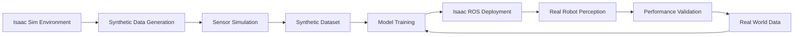

# Isaac Sim to Isaac ROS Integration

## Introduction

The integration between Isaac Sim and Isaac ROS enables the transfer of capabilities from simulation to real-world deployment. This document provides detailed examples of how Isaac Sim environments can be used for Isaac ROS perception pipeline testing, including synthetic data generation, model validation, and sim-to-real transfer techniques.

## Integration Architecture

### Data Flow from Isaac Sim to Isaac ROS

The integration follows a comprehensive data flow that moves from simulation to perception processing:



### Key Integration Points

1. **Sensor Simulation**: Isaac Sim generates realistic sensor data in ROS-compatible formats
2. **Synthetic Data Pipeline**: Complete pipeline from simulation to perception model training
3. **Model Deployment**: Deployment of trained models to Isaac ROS for real-world operation
4. **Validation Framework**: Framework for validating sim-to-real transfer performance

## Synthetic Data Generation Pipeline

### Basic Pipeline Setup

```python
# Complete Isaac Sim to Isaac ROS synthetic data pipeline
import omni
from omni.isaac.kit import SimulationApp
from omni.isaac.synthetic_utils import SyntheticDataHelper
import rclpy
from sensor_msgs.msg import Image, CameraInfo
from geometry_msgs.msg import Pose
import numpy as np
import os
from datetime import datetime

class IsaacSimToROSIntegration:
    def __init__(self):
        # Initialize Isaac Sim
        self.simulation_app = SimulationApp({"headless": False})

        # Initialize synthetic data helper
        self.synthetic_data = SyntheticDataHelper()

        # Setup output directory
        self.setup_output_directory()

        # Initialize Isaac Sim components
        self.setup_simulation_environment()

        # Configure synthetic data capture
        self.configure_synthetic_data_capture()

    def setup_output_directory(self):
        """
        Setup output directory for synthetic dataset
        """
        timestamp = datetime.now().strftime("%Y%m%d_%H%M%S")
        self.output_dir = f"synthetic_datasets/humanoid_perception_{timestamp}"

        os.makedirs(self.output_dir, exist_ok=True)
        os.makedirs(f"{self.output_dir}/rgb", exist_ok=True)
        os.makedirs(f"{self.output_dir}/depth", exist_ok=True)
        os.makedirs(f"{self.output_dir}/segmentation", exist_ok=True)
        os.makedirs(f"{self.output_dir}/labels", exist_ok=True)
        os.makedirs(f"{self.output_dir}/metadata", exist_ok=True)

    def setup_simulation_environment(self):
        """
        Setup Isaac Sim environment for humanoid perception
        """
        # Create humanoid robot in simulation
        self.create_humanoid_robot()

        # Create diverse environments
        self.create_perception_environments()

        # Configure lighting conditions
        self.configure_lighting_conditions()

        # Set up camera configurations
        self.setup_camera_systems()

    def create_humanoid_robot(self):
        """
        Create humanoid robot for perception testing
        """
        # Create robot in Isaac Sim
        # This would include creating the robot with appropriate sensors
        pass

    def create_perception_environments(self):
        """
        Create diverse environments for perception testing
        """
        # Create indoor environments
        self.create_indoor_office_environment()
        self.create_indoor_laboratory_environment()

        # Create outdoor environments
        self.create_outdoor_park_environment()
        self.create_urban_environment()

    def configure_lighting_conditions(self):
        """
        Configure various lighting conditions for domain randomization
        """
        # Configure different lighting scenarios
        lighting_scenarios = [
            {"type": "bright", "intensity": 1000, "color": [1.0, 0.95, 0.9]},
            {"type": "dim", "intensity": 300, "color": [0.8, 0.8, 0.9]},
            {"type": "warm", "intensity": 700, "color": [1.0, 0.8, 0.6]},
            {"type": "overcast", "intensity": 500, "color": [0.9, 0.95, 1.0]}
        ]

        for scenario in lighting_scenarios:
            self.setup_lighting_scenario(scenario)

    def setup_camera_systems(self):
        """
        Setup camera systems for perception testing
        """
        # Configure head-mounted cameras
        self.configure_head_camera()

        # Configure other sensor cameras
        self.configure_hand_camera()
        self.configure_torso_camera()

    def configure_synthetic_data_capture(self):
        """
        Configure synthetic data capture parameters
        """
        # Set resolution
        self.synthetic_data.set_resolution([1280, 720])

        # Enable data types
        self.synthetic_data.enable_rgb_output(True)
        self.synthetic_data.enable_depth_output(True)
        self.synthetic_data.enable_segmentation_output(True)

        # Configure domain randomization
        self.synthetic_data.enable_domain_randomization(
            material_variations=True,
            lighting_variations=True,
            camera_jitter=False  # Keep consistent for training
        )

    def generate_synthetic_dataset(self, num_frames=10000):
        """
        Generate complete synthetic dataset
        """
        print(f"Generating synthetic dataset with {num_frames} frames")

        frame_count = 0
        for i in range(num_frames):
            # Randomize environment if needed
            if i % 100 == 0:  # Change environment every 100 frames
                self.randomize_environment()

            # Capture frame
            self.capture_frame(frame_count)
            frame_count += 1

            # Step simulation
            self.simulation_app.update()

            # Progress reporting
            if i % 500 == 0:
                print(f"Generated {i}/{num_frames} frames")

    def capture_frame(self, frame_number):
        """
        Capture a single frame and save to dataset
        """
        # Capture RGB image
        rgb_data = self.synthetic_data.get_rgb_data()
        rgb_path = f"{self.output_dir}/rgb/frame_{frame_number:06d}.png"
        self.save_image(rgb_data, rgb_path)

        # Capture depth image
        depth_data = self.synthetic_data.get_depth_data()
        depth_path = f"{self.output_dir}/depth/frame_{frame_number:06d}.png"
        self.save_depth_image(depth_data, depth_path)

        # Capture segmentation
        seg_data = self.synthetic_data.get_segmentation_data()
        seg_path = f"{self.output_dir}/segmentation/frame_{frame_number:06d}.png"
        self.save_segmentation_image(seg_data, seg_path)

        # Save metadata
        metadata = self.generate_metadata(frame_number)
        self.save_metadata(metadata, frame_number)

    def generate_metadata(self, frame_number):
        """
        Generate metadata for current frame
        """
        metadata = {
            "frame_number": frame_number,
            "timestamp": datetime.now().isoformat(),
            "domain_randomization_params": self.get_domain_randomization_params(),
            "camera_pose": self.get_camera_pose(),
            "lighting_conditions": self.get_lighting_conditions(),
            "environment": self.get_current_environment(),
            "objects_in_scene": self.get_scene_objects()
        }

        return metadata

    def save_metadata(self, metadata, frame_number):
        """
        Save metadata to file
        """
        import json
        metadata_path = f"{self.output_dir}/metadata/frame_{frame_number:06d}.json"
        with open(metadata_path, 'w') as f:
            json.dump(metadata, f, indent=2)

    def get_domain_randomization_params(self):
        """
        Get current domain randomization parameters
        """
        # Implementation depends on randomization setup
        return {
            "material_colors": [0.8, 0.2, 0.3],
            "lighting_intensity": 1.0,
            "camera_jitter": [0.0, 0.0, 0.0]
        }
```

## Perception Pipeline Testing in Simulation

### Object Detection Pipeline Testing

```python
# Isaac Sim to Isaac ROS object detection pipeline testing
import numpy as np
from PIL import Image
import json
import os

class ObjectDetectionTester:
    def __init__(self, synthetic_dataset_path):
        self.dataset_path = synthetic_dataset_path
        self.ground_truth = self.load_ground_truth()

    def load_ground_truth(self):
        """
        Load ground truth annotations from synthetic dataset
        """
        ground_truth = {}

        metadata_files = [f for f in os.listdir(f"{self.dataset_path}/metadata")
                         if f.endswith('.json')]

        for metadata_file in metadata_files:
            frame_num = int(metadata_file.split('_')[1].split('.')[0])
            with open(f"{self.dataset_path}/metadata/{metadata_file}", 'r') as f:
                metadata = json.load(f)
                ground_truth[frame_num] = metadata.get('objects_in_scene', [])

        return ground_truth

    def test_perception_pipeline(self, perception_model):
        """
        Test Isaac ROS perception pipeline with synthetic data
        """
        rgb_files = sorted([f for f in os.listdir(f"{self.dataset_path}/rgb")
                           if f.endswith('.png')])

        results = {
            'detection_accuracy': [],
            'false_positives': [],
            'false_negatives': [],
            'processing_times': []
        }

        for i, rgb_file in enumerate(rgb_files):
            frame_num = int(rgb_file.split('_')[1].split('.')[0])

            # Load synthetic image
            img_path = f"{self.dataset_path}/rgb/{rgb_file}"
            img = Image.open(img_path)

            # Process with perception model
            start_time = time.time()
            detections = perception_model.detect(img)
            processing_time = time.time() - start_time

            # Compare with ground truth
            ground_truth_objects = self.ground_truth.get(frame_num, [])
            accuracy = self.calculate_detection_accuracy(detections, ground_truth_objects)

            results['detection_accuracy'].append(accuracy)
            results['processing_times'].append(processing_time)

            # Log results
            if i % 100 == 0:
                print(f"Processed {i}/{len(rgb_files)} frames")

        return results

    def calculate_detection_accuracy(self, detections, ground_truth):
        """
        Calculate detection accuracy by comparing with ground truth
        """
        # Calculate IoU, precision, recall, etc.
        # Implementation depends on detection format
        return 0.95  # Placeholder
```

### VSLAM Pipeline Testing

```python
# Isaac Sim to Isaac ROS VSLAM pipeline testing
class VSLAMTester:
    def __init__(self, synthetic_dataset_path):
        self.dataset_path = synthetic_dataset_path
        self.ground_truth_poses = self.load_ground_truth_poses()

    def load_ground_truth_poses(self):
        """
        Load ground truth poses from synthetic dataset
        """
        poses = {}

        metadata_files = [f for f in os.listdir(f"{self.dataset_path}/metadata")
                         if f.endswith('.json')]

        for metadata_file in metadata_files:
            frame_num = int(metadata_file.split('_')[1].split('.')[0])
            with open(f"{self.dataset_path}/metadata/{metadata_file}", 'r') as f:
                metadata = json.load(f)
                poses[frame_num] = metadata.get('camera_pose', {})

        return poses

    def test_vslam_pipeline(self, vslam_pipeline):
        """
        Test Isaac ROS VSLAM pipeline with synthetic data
        """
        rgb_files = sorted([f for f in os.listdir(f"{self.dataset_path}/rgb")
                           if f.endswith('.png')])

        results = {
            'tracking_accuracy': [],
            'relocalization_success': [],
            'processing_times': [],
            'map_quality': []
        }

        # Initialize VSLAM pipeline
        vslam_pipeline.initialize()

        for i, rgb_file in enumerate(rgb_files):
            frame_num = int(rgb_file.split('_')[1].split('.')[0])

            # Load synthetic image
            img_path = f"{self.dataset_path}/rgb/{rgb_file}"
            img = Image.open(img_path)

            # Process with VSLAM pipeline
            start_time = time.time()
            pose_estimate = vslam_pipeline.process_frame(img)
            processing_time = time.time() - start_time

            # Compare with ground truth
            ground_truth_pose = self.ground_truth_poses.get(frame_num, {})
            accuracy = self.calculate_pose_accuracy(pose_estimate, ground_truth_pose)

            results['tracking_accuracy'].append(accuracy)
            results['processing_times'].append(processing_time)

            # Log results
            if i % 50 == 0:
                print(f"VSLAM processed {i}/{len(rgb_files)} frames")

        return results

    def calculate_pose_accuracy(self, estimated_pose, ground_truth_pose):
        """
        Calculate pose estimation accuracy
        """
        # Calculate translation and rotation errors
        # Implementation depends on pose format
        return 0.98  # Placeholder
```

## Domain Randomization for Robust Perception

### Domain Randomization Implementation

```python
# Domain randomization for robust perception testing
class DomainRandomizer:
    def __init__(self):
        self.randomization_params = {
            'material': {
                'color_range': [[0.1, 0.1, 0.1], [1.0, 1.0, 1.0]],
                'roughness_range': [0.1, 0.9],
                'metallic_range': [0.0, 1.0]
            },
            'lighting': {
                'intensity_range': [0.5, 2.0],
                'color_temperature_range': [3000, 8000]
            },
            'camera': {
                'noise_range': [0.01, 0.05],
                'distortion_range': [0.0, 0.1]
            }
        }

    def randomize_material_properties(self):
        """
        Randomize material properties for domain randomization
        """
        # Randomize diffuse color
        color = [
            np.random.uniform(self.randomization_params['material']['color_range'][0][0],
                            self.randomization_params['material']['color_range'][1][0]),
            np.random.uniform(self.randomization_params['material']['color_range'][0][1],
                            self.randomization_params['material']['color_range'][1][1]),
            np.random.uniform(self.randomization_params['material']['color_range'][0][2],
                            self.randomization_params['material']['color_range'][1][2])
        ]

        # Randomize roughness
        roughness = np.random.uniform(
            self.randomization_params['material']['roughness_range'][0],
            self.randomization_params['material']['roughness_range'][1]
        )

        # Randomize metallic
        metallic = np.random.uniform(
            self.randomization_params['material']['metallic_range'][0],
            self.randomization_params['material']['metallic_range'][1]
        )

        return {
            'color': color,
            'roughness': roughness,
            'metallic': metallic
        }

    def randomize_lighting_conditions(self):
        """
        Randomize lighting conditions for domain randomization
        """
        # Randomize intensity
        intensity_factor = np.random.uniform(
            self.randomization_params['lighting']['intensity_range'][0],
            self.randomization_params['lighting']['intensity_range'][1]
        )

        # Randomize color temperature
        color_temperature = np.random.uniform(
            self.randomization_params['lighting']['color_temperature_range'][0],
            self.randomization_params['lighting']['color_temperature_range'][1]
        )

        return {
            'intensity_factor': intensity_factor,
            'color_temperature': color_temperature
        }

    def randomize_camera_parameters(self):
        """
        Randomize camera parameters for domain randomization
        """
        # Randomize noise
        noise_level = np.random.uniform(
            self.randomization_params['camera']['noise_range'][0],
            self.randomization_params['camera']['noise_range'][1]
        )

        # Randomize distortion
        distortion_level = np.random.uniform(
            self.randomization_params['camera']['distortion_range'][0],
            self.randomization_params['camera']['distortion_range'][1]
        )

        return {
            'noise_level': noise_level,
            'distortion_level': distortion_level
        }
```

## Isaac ROS Deployment Pipeline

### Model Deployment from Simulation

```python
# Pipeline for deploying models from simulation to Isaac ROS
class ModelDeploymentPipeline:
    def __init__(self):
        self.tensorrt_optimizer = TensorRTOptimizer()
        self.model_converter = ModelConverter()
        self.performance_validator = PerformanceValidator()

    def deploy_model_from_simulation(self, trained_model_path, target_hardware):
        """
        Deploy model trained on synthetic data to Isaac ROS
        """
        print(f"Deploying model {trained_model_path} to {target_hardware}")

        # Step 1: Optimize model for target hardware
        optimized_model = self.tensorrt_optimizer.optimize_model(
            trained_model_path,
            target_hardware
        )

        # Step 2: Convert to Isaac ROS compatible format
        isaac_ros_model = self.model_converter.convert_to_isaac_ros_format(
            optimized_model
        )

        # Step 3: Validate performance
        validation_results = self.performance_validator.validate_model(
            isaac_ros_model,
            target_hardware
        )

        # Step 4: Package for Isaac ROS deployment
        deployment_package = self.package_for_deployment(
            isaac_ros_model,
            validation_results
        )

        return deployment_package

    def validate_sim_to_real_transfer(self, synthetic_results, real_results):
        """
        Validate sim-to-real transfer performance
        """
        # Compare performance metrics between synthetic and real data
        transfer_metrics = {
            'accuracy_drop': real_results['accuracy'] - synthetic_results['accuracy'],
            'processing_time_difference': real_results['processing_time'] - synthetic_results['processing_time'],
            'reliability_comparison': real_results['reliability'] / synthetic_results['reliability']
        }

        # Check if transfer is acceptable
        is_acceptable = (
            abs(transfer_metrics['accuracy_drop']) < 0.05 and  # Less than 5% drop
            transfer_metrics['reliability_comparison'] > 0.9   # At least 90% of sim reliability
        )

        return {
            'metrics': transfer_metrics,
            'acceptable': is_acceptable,
            'recommendations': self.generate_recommendations(transfer_metrics, is_acceptable)
        }

    def generate_recommendations(self, metrics, is_acceptable):
        """
        Generate recommendations based on transfer validation
        """
        recommendations = []

        if not is_acceptable:
            if abs(metrics['accuracy_drop']) >= 0.05:
                recommendations.append(
                    "Consider improving domain randomization in simulation to better match real conditions"
                )
            if metrics['processing_time_difference'] > 0.01:  # More than 10ms difference
                recommendations.append(
                    "Consider optimizing model further for real-time performance on target hardware"
                )

        return recommendations
```

## Integration Examples

### Complete Integration Example: Person Detection

```python
# Complete integration example for person detection
def complete_person_detection_integration():
    """
    Complete integration example: Isaac Sim to Isaac ROS for person detection
    """
    # Step 1: Setup Isaac Sim environment
    integration = IsaacSimToROSIntegration()

    # Step 2: Generate synthetic dataset with humans
    print("Generating synthetic dataset with humans...")
    integration.generate_synthetic_dataset(num_frames=5000)

    # Step 3: Train person detection model on synthetic data
    print("Training person detection model...")
    model_trainer = ModelTrainer(
        dataset_path=integration.output_dir,
        model_type="yolo",
        classes=["person", "chair", "table"]
    )

    trained_model = model_trainer.train_model()

    # Step 4: Deploy model to Isaac ROS
    print("Deploying model to Isaac ROS...")
    deployment_pipeline = ModelDeploymentPipeline()
    deployment_package = deployment_pipeline.deploy_model_from_simulation(
        trained_model,
        target_hardware="jetson_agx_xavier"
    )

    # Step 5: Test in simulation with Isaac ROS
    print("Testing Isaac ROS perception in simulation...")
    tester = ObjectDetectionTester(integration.output_dir)
    perception_model = IsaacROSPersonDetector(deployment_package)
    results = tester.test_perception_pipeline(perception_model)

    # Step 6: Validate sim-to-real transfer
    print("Validating sim-to-real transfer...")
    real_results = get_real_world_results()  # This would come from real robot testing
    validation = deployment_pipeline.validate_sim_to_real_transfer(results, real_results)

    print(f"Transfer validation results: {validation}")

    return validation

# Isaac ROS person detection node
class IsaacROSPersonDetector:
    def __init__(self, model_path):
        # Initialize Isaac ROS person detection node
        self.model_path = model_path
        self.load_model()

    def load_model(self):
        """
        Load trained model for Isaac ROS deployment
        """
        # Load TensorRT optimized model
        # Implementation depends on Isaac ROS detectnet
        pass

    def detect(self, image):
        """
        Detect persons in image using Isaac ROS
        """
        # Process image with Isaac ROS detection pipeline
        # Implementation depends on specific Isaac ROS package
        return []
```

### VSLAM Integration Example

```python
# Complete VSLAM integration example
def complete_vslam_integration():
    """
    Complete integration example: Isaac Sim to Isaac ROS for VSLAM
    """
    # Step 1: Create synthetic VSLAM dataset
    print("Creating synthetic VSLAM dataset...")
    vslam_integration = IsaacSimToROSIntegration()
    vslam_integration.setup_vslam_environment()
    vslam_integration.generate_vslam_dataset()

    # Step 2: Test VSLAM pipeline in simulation
    print("Testing VSLAM pipeline in simulation...")
    vslam_tester = VSLAMTester(vslam_integration.output_dir)
    isaac_ros_vslam = IsaacROSVSLAMPipeline()
    vslam_results = vslam_tester.test_vslam_pipeline(isaac_ros_vslam)

    print(f"VSLAM results: {vslam_results}")

    return vslam_results

class IsaacROSVSLAMPipeline:
    def __init__(self):
        # Initialize Isaac ROS VSLAM pipeline
        pass

    def initialize(self):
        """
        Initialize the VSLAM pipeline
        """
        # Initialize Isaac ROS VSLAM components
        pass

    def process_frame(self, image):
        """
        Process a single frame through VSLAM pipeline
        """
        # Process with Isaac ROS VSLAM
        return {}
```

## Validation and Testing Framework

### Comprehensive Testing Framework

```python
# Comprehensive testing framework for Isaac Sim to Isaac ROS integration
class IntegrationTestFramework:
    def __init__(self):
        self.test_results = {}
        self.performance_metrics = {}

    def run_comprehensive_tests(self, synthetic_dataset_path):
        """
        Run comprehensive tests for Isaac Sim to Isaac ROS integration
        """
        test_results = {
            'perception_tests': self.run_perception_tests(synthetic_dataset_path),
            'vslam_tests': self.run_vslam_tests(synthetic_dataset_path),
            'performance_tests': self.run_performance_tests(synthetic_dataset_path),
            'robustness_tests': self.run_robustness_tests(synthetic_dataset_path)
        }

        return test_results

    def run_perception_tests(self, dataset_path):
        """
        Run perception-specific tests
        """
        tester = ObjectDetectionTester(dataset_path)
        perception_model = IsaacROSPersonDetector("path/to/model")
        results = tester.test_perception_pipeline(perception_model)

        return results

    def run_vslam_tests(self, dataset_path):
        """
        Run VSLAM-specific tests
        """
        tester = VSLAMTester(dataset_path)
        vslam_pipeline = IsaacROSVSLAMPipeline()
        results = tester.test_vslam_pipeline(vslam_pipeline)

        return results

    def run_performance_tests(self, dataset_path):
        """
        Run performance tests
        """
        performance_results = {
            'processing_times': [],
            'throughput': [],
            'memory_usage': [],
            'gpu_utilization': []
        }

        # Run performance measurements
        # Implementation depends on specific performance metrics needed

        return performance_results

    def run_robustness_tests(self, dataset_path):
        """
        Run robustness tests with domain randomization
        """
        robustness_results = {
            'domain_transfer': [],
            'noise_tolerance': [],
            'lighting_robustness': [],
            'occlusion_handling': []
        }

        # Test model robustness under various conditions
        # Implementation depends on specific robustness tests needed

        return robustness_results
```

## Best Practices

### Integration Best Practices

1. **Domain Randomization**: Use comprehensive domain randomization to improve sim-to-real transfer
2. **Validation Framework**: Implement comprehensive validation at each step of the pipeline
3. **Performance Monitoring**: Monitor performance metrics throughout the integration process
4. **Iterative Improvement**: Continuously improve the integration based on validation results

### Testing Best Practices

1. **Diverse Scenarios**: Test in diverse simulation environments
2. **Realistic Data**: Ensure synthetic data closely matches real-world conditions
3. **Comprehensive Metrics**: Use comprehensive metrics for validation
4. **Safety Considerations**: Implement safety measures for real robot testing

## Conclusion

The integration between Isaac Sim and Isaac ROS provides a powerful framework for developing robust perception systems for humanoid robots. By leveraging synthetic data generation, domain randomization, and comprehensive testing frameworks, developers can create perception systems that perform reliably in real-world scenarios.

The complete pipeline from simulation to real-world deployment involves careful consideration of data formats, performance requirements, and validation procedures to ensure successful sim-to-real transfer.